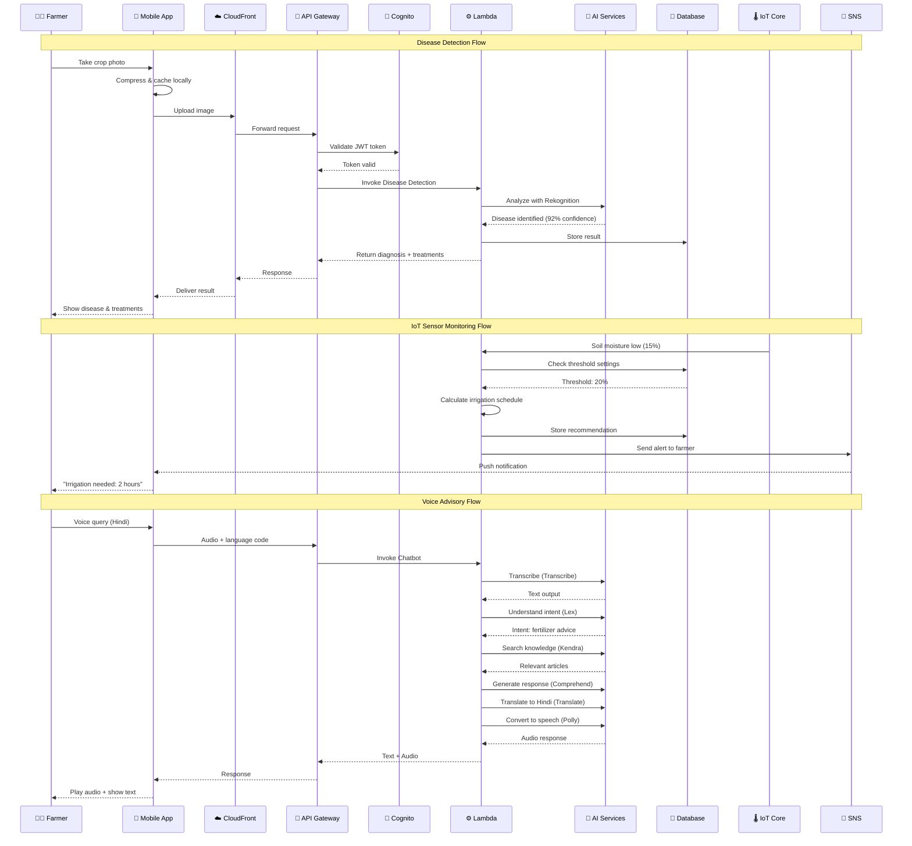
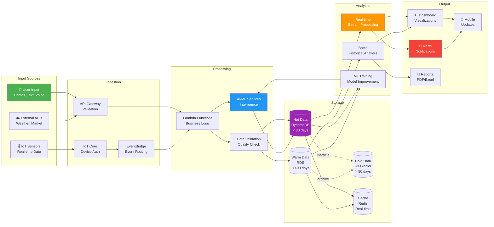
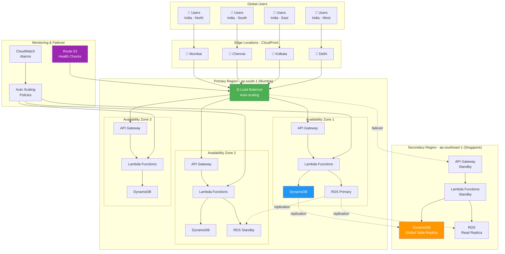
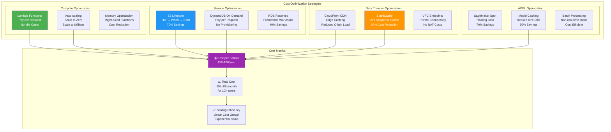

# Architecture Diagram - AI Rural Innovation Platform
## Comprehensive Solution Architecture for Presentation

---

## MAIN ARCHITECTURE DIAGRAM - PROPOSED SOLUTION

```mermaid
graph TB
    subgraph "USER LAYER - Rural Farmers & Stakeholders"
        U1[👨‍🌾 Farmers<br/>10,000+ Users<br/>Mobile App]
        U2[🏢 Buyers<br/>Marketplace Access<br/>Web/Mobile]
        U3[👨‍🏫 Agricultural Experts<br/>Advisory Support<br/>Web Portal]
        U4[👨‍💼 System Admins<br/>Platform Management<br/>Admin Dashboard]
    end
    
    subgraph "CLIENT LAYER - Multi-Platform Access"
        C1[📱 React Native App<br/>iOS & Android<br/>Offline-First Design]
        C2[🌐 Web Application<br/>Admin & Buyer Portal<br/>React.js]
        C3[💾 Local Storage<br/>IndexedDB/SQLite<br/>Offline Cache]
        C4[🎤 Voice Interface<br/>5 Regional Languages<br/>Speech Recognition]
    end
    
    subgraph "EDGE LAYER - Content Delivery & Security"
        E1[☁️ CloudFront CDN<br/>Global Distribution<br/>Low Latency]
        E2[🛡️ AWS WAF<br/>Web Application Firewall<br/>DDoS Protection]
        E3[🔐 Route 53<br/>DNS Management<br/>Health Checks]
    end
    
    subgraph "API GATEWAY LAYER - Request Management"
        G1[🔌 API Gateway<br/>REST & GraphQL APIs<br/>Rate Limiting]
        G2[🔑 AWS Cognito<br/>User Authentication<br/>JWT Tokens]
        G3[⚡ Lambda Authorizer<br/>Custom Authorization<br/>RBAC]
    end
    
    subgraph "APPLICATION LAYER - Core Business Logic"
        subgraph "Smart Agriculture Services"
            A1[🌾 Disease Detection<br/>Lambda Function<br/>Image Analysis]
            A2[📈 Yield Prediction<br/>Lambda Function<br/>ML Forecasting]
            A3[🌱 Soil Health<br/>Lambda Function<br/>Trend Analysis]
        end
        
        subgraph "Market & Resource Services"
            A4[💰 Market Intelligence<br/>Lambda Function<br/>Price & Demand]
            A5[💧 Resource Optimizer<br/>Lambda Function<br/>Water & Fertilizer]
            A6[🛒 Marketplace<br/>Lambda Function<br/>Buyer Matching]
        end
        
        subgraph "Advisory & Support Services"
            A7[🤖 AI Chatbot<br/>Lambda Function<br/>Voice & Text]
            A8[🔔 Alert Manager<br/>Lambda Function<br/>Multi-Channel Alerts]
            A9[🔄 Sync Manager<br/>Lambda Function<br/>Offline Sync]
        end
        
        subgraph "Analytics & Reporting"
            A10[📊 Dashboard Service<br/>Lambda Function<br/>Real-time Analytics]
            A11[📋 Report Generator<br/>Lambda Function<br/>PDF/Excel Export]
        end
    end
    
    subgraph "AI/ML LAYER - Intelligent Services"
        AI1[👁️ Amazon Rekognition<br/>Custom Labels<br/>Disease Recognition]
        AI2[🧠 Amazon SageMaker<br/>Custom ML Models<br/>Yield & Demand Prediction]
        AI3[📊 Amazon Forecast<br/>Time-Series Analysis<br/>DeepAR+ Algorithm]
        AI4[💬 Amazon Lex<br/>Conversational AI<br/>Intent Recognition]
        AI5[🗣️ Amazon Polly<br/>Text-to-Speech<br/>5 Languages]
        AI6[🌐 Amazon Translate<br/>Language Translation<br/>Real-time]
        AI7[🔍 Amazon Kendra<br/>Intelligent Search<br/>Knowledge Base]
        AI8[📝 Amazon Comprehend<br/>NLP & Sentiment<br/>Text Analysis]
    end
    
    subgraph "DATA LAYER - Storage & Persistence"
        subgraph "NoSQL Storage"
            D1[(DynamoDB<br/>Farmers & Farms<br/>Partition: farmer_id)]
            D2[(DynamoDB<br/>Disease Results<br/>Partition: result_id)]
            D3[(DynamoDB<br/>Sensor Readings<br/>TTL: 90 days)]
            D4[(DynamoDB<br/>Alerts & Notifications<br/>TTL: 30 days)]
        end
        
        subgraph "Relational Storage"
            D5[(RDS PostgreSQL<br/>Market Prices<br/>Time-Series Data)]
            D6[(RDS PostgreSQL<br/>Transactions<br/>Marketplace Data)]
            D7[(RDS PostgreSQL<br/>Knowledge Base<br/>Articles & Videos)]
        end
        
        subgraph "Object Storage"
            D8[(S3 Bucket<br/>Disease Images<br/>Lifecycle: 30d→Glacier)]
            D9[(S3 Bucket<br/>Offline Cache<br/>Lifecycle: 7d→Delete)]
            D10[(S3 Bucket<br/>Knowledge Assets<br/>Videos & PDFs)]
        end
        
        subgraph "Caching Layer"
            D11[(ElastiCache Redis<br/>Session Data<br/>API Response Cache)]
            D12[(DynamoDB DAX<br/>Accelerator<br/>Microsecond Latency)]
        end
    end
    
    subgraph "IOT LAYER - Field Sensors & Devices"
        I1[🌡️ Soil Moisture Sensors<br/>Real-time Monitoring<br/>15-min Intervals]
        I2[🌡️ Temperature Sensors<br/>Air & Soil Temp<br/>Continuous]
        I3[💧 pH & NPK Sensors<br/>Soil Health<br/>Daily Readings]
        I4[📡 IoT Gateway<br/>AWS IoT Core<br/>MQTT Protocol]
        I5[🔐 Device Registry<br/>X.509 Certificates<br/>Secure Auth]
    end
    
    subgraph "INTEGRATION LAYER - External Services & Events"
        INT1[⚡ EventBridge<br/>Event Bus<br/>Async Processing]
        INT2[📨 Amazon SNS<br/>Push Notifications<br/>SMS Delivery]
        INT3[📬 Amazon SQS<br/>Message Queue<br/>Reliable Delivery]
        INT4[☁️ Weather APIs<br/>IMD & OpenWeather<br/>Forecast Data]
        INT5[💹 Market APIs<br/>AGMARKNET<br/>Price Data]
        INT6[💳 Payment Gateway<br/>Razorpay & UPI<br/>Transactions]
    end
    
    subgraph "MONITORING & OPERATIONS LAYER"
        M1[📊 CloudWatch<br/>Metrics & Logs<br/>Real-time Monitoring]
        M2[🔍 X-Ray<br/>Distributed Tracing<br/>Performance Analysis]
        M3[📋 CloudTrail<br/>Audit Logs<br/>Compliance]
        M4[🚨 CloudWatch Alarms<br/>Automated Alerts<br/>Threshold-based]
        M5[📱 PagerDuty<br/>On-Call Management<br/>Incident Response]
    end
    
    subgraph "SECURITY LAYER - Protection & Compliance"
        S1[🔒 KMS<br/>Key Management<br/>Encryption Keys]
        S2[🔐 Secrets Manager<br/>Credentials<br/>API Keys]
        S3[👤 IAM<br/>Access Control<br/>Least Privilege]
        S4[🛡️ AWS Shield<br/>DDoS Protection<br/>Standard & Advanced]
        S5[📜 AWS Config<br/>Compliance<br/>Resource Tracking]
    end
    
    %% User to Client Connections
    U1 --> C1
    U2 --> C2
    U3 --> C2
    U4 --> C2
    C1 --> C3
    C1 --> C4
    
    %% Client to Edge Connections
    C1 --> E1
    C2 --> E1
    E1 --> E2
    E2 --> E3
    
    %% Edge to API Gateway
    E3 --> G1
    G1 --> G2
    G2 --> G3
    
    %% API Gateway to Application Layer
    G3 --> A1
    G3 --> A2
    G3 --> A3
    G3 --> A4
    G3 --> A5
    G3 --> A6
    G3 --> A7
    G3 --> A8
    G3 --> A9
    G3 --> A10
    G3 --> A11
    
    %% Application to AI/ML Services
    A1 --> AI1
    A1 --> AI2
    A2 --> AI2
    A2 --> AI3
    A3 --> AI2
    A4 --> AI2
    A5 --> AI2
    A7 --> AI4
    A7 --> AI5
    A7 --> AI6
    A7 --> AI7
    A7 --> AI8
    
    %% Application to Data Layer
    A1 --> D1
    A1 --> D2
    A1 --> D8
    A2 --> D1
    A2 --> D11
    A3 --> D1
    A3 --> D3
    A4 --> D5
    A4 --> D11
    A5 --> D1
    A5 --> D3
    A6 --> D6
    A7 --> D7
    A7 --> D11
    A8 --> D4
    A9 --> D9
    A10 --> D1
    A10 --> D5
    A11 --> D1
    A11 --> D5
    
    %% Data Layer Caching
    D1 --> D12
    D2 --> D12
    D5 --> D11
    
    %% IoT Layer Connections
    I1 --> I4
    I2 --> I4
    I3 --> I4
    I4 --> I5
    I5 --> INT1
    INT1 --> A5
    INT1 --> A8
    
    %% Integration Layer
    A8 --> INT2
    A9 --> INT3
    A2 --> INT4
    A4 --> INT5
    A6 --> INT6
    
    %% Monitoring Connections
    A1 --> M1
    A2 --> M1
    A3 --> M1
    A4 --> M1
    A5 --> M1
    A6 --> M1
    A7 --> M1
    A8 --> M1
    A9 --> M1
    A10 --> M1
    A11 --> M1
    M1 --> M2
    M1 --> M4
    M4 --> M5
    G1 --> M3
    
    %% Security Connections
    D1 --> S1
    D2 --> S1
    D5 --> S1
    D8 --> S1
    A1 --> S2
    A4 --> S2
    G2 --> S3
    E2 --> S4
    M1 --> S5
    
    %% Styling
    style U1 fill:#4CAF50,color:#fff,stroke:#2E7D32,stroke-width:3px
    style C1 fill:#2196F3,color:#fff,stroke:#1565C0,stroke-width:3px
    style G1 fill:#FF9800,color:#fff,stroke:#E65100,stroke-width:3px
    style AI2 fill:#9C27B0,color:#fff,stroke:#6A1B9A,stroke-width:3px
    style D1 fill:#F44336,color:#fff,stroke:#C62828,stroke-width:3px
    style I4 fill:#00BCD4,color:#fff,stroke:#00838F,stroke-width:3px
    style M1 fill:#607D8B,color:#fff,stroke:#37474F,stroke-width:3px
    style S1 fill:#795548,color:#fff,stroke:#4E342E,stroke-width:3px
```



---

## SIMPLIFIED LAYERED ARCHITECTURE

```
┌─────────────────────────────────────────────────────────────────────────────┐
│                          USER LAYER                                         │
│  👨‍🌾 Farmers (10K+)  |  🏢 Buyers  |  👨‍🏫 Experts  |  👨‍💼 Admins          │
└─────────────────────────────────────────────────────────────────────────────┘
                                    ↓
┌─────────────────────────────────────────────────────────────────────────────┐
│                        CLIENT LAYER                                         │
│  📱 React Native Mobile App (iOS/Android) - Offline-First                  │
│  🌐 Web Application (React.js) - Admin & Buyer Portal                      │
│  🎤 Voice Interface - 5 Regional Languages                                  │
│  💾 Local Storage - IndexedDB/SQLite for Offline                           │
└─────────────────────────────────────────────────────────────────────────────┘
                                    ↓
┌─────────────────────────────────────────────────────────────────────────────┐
│                    EDGE & CDN LAYER                                         │
│  ☁️ CloudFront CDN - Global Content Delivery                               │
│  🛡️ AWS WAF - Web Application Firewall & DDoS Protection                   │
│  🔐 Route 53 - DNS Management & Health Checks                               │
└─────────────────────────────────────────────────────────────────────────────┘
                                    ↓
┌─────────────────────────────────────────────────────────────────────────────┐
│                   API GATEWAY & AUTH LAYER                                  │
│  🔌 API Gateway - REST & GraphQL APIs, Rate Limiting                        │
│  🔑 AWS Cognito - User Authentication, JWT Tokens                           │
│  ⚡ Lambda Authorizer - Custom Authorization, RBAC                          │
└─────────────────────────────────────────────────────────────────────────────┘
                                    ↓
┌─────────────────────────────────────────────────────────────────────────────┐
│                    APPLICATION LAYER (Lambda Functions)                     │
│                                                                             │
│  ┌─────────────────────────────────────────────────────────────────────┐   │
│  │  SMART AGRICULTURE SERVICES                                         │   │
│  │  🌾 Disease Detection  |  📈 Yield Prediction  |  🌱 Soil Health    │   │
│  └─────────────────────────────────────────────────────────────────────┘   │
│                                                                             │
│  ┌─────────────────────────────────────────────────────────────────────┐   │
│  │  MARKET & RESOURCE SERVICES                                         │   │
│  │  💰 Market Intelligence  |  💧 Resource Optimizer  |  🛒 Marketplace │   │
│  └─────────────────────────────────────────────────────────────────────┘   │
│                                                                             │
│  ┌─────────────────────────────────────────────────────────────────────┐   │
│  │  ADVISORY & SUPPORT SERVICES                                        │   │
│  │  🤖 AI Chatbot  |  🔔 Alert Manager  |  🔄 Sync Manager            │   │
│  └─────────────────────────────────────────────────────────────────────┘   │
│                                                                             │
│  ┌─────────────────────────────────────────────────────────────────────┐   │
│  │  ANALYTICS & REPORTING                                              │   │
│  │  📊 Dashboard Service  |  📋 Report Generator                        │   │
│  └─────────────────────────────────────────────────────────────────────┘   │
└─────────────────────────────────────────────────────────────────────────────┘
                                    ↓
┌─────────────────────────────────────────────────────────────────────────────┐
│                      AI/ML SERVICES LAYER                                   │
│  👁️ Rekognition (Disease)  |  🧠 SageMaker (Custom ML)                     │
│  📊 Forecast (Time-Series)  |  💬 Lex (Chatbot)                             │
│  🗣️ Polly (TTS)  |  🌐 Translate  |  🔍 Kendra  |  📝 Comprehend           │
└─────────────────────────────────────────────────────────────────────────────┘
                                    ↓
┌─────────────────────────────────────────────────────────────────────────────┐
│                        DATA STORAGE LAYER                                   │
│                                                                             │
│  ┌──────────────────┐  ┌──────────────────┐  ┌──────────────────┐         │
│  │  NoSQL Storage   │  │ Relational DB    │  │ Object Storage   │         │
│  │  ─────────────   │  │ ─────────────    │  │ ──────────────   │         │
│  │  • DynamoDB      │  │  • RDS           │  │  • S3 Buckets    │         │
│  │    - Farmers     │  │    PostgreSQL    │  │    - Images      │         │
│  │    - Diseases    │  │    - Market      │  │    - Cache       │         │
│  │    - Sensors     │  │    - Transactions│  │    - Assets      │         │
│  │    - Alerts      │  │    - Knowledge   │  │                  │         │
│  └──────────────────┘  └──────────────────┘  └──────────────────┘         │
│                                                                             │
│  ┌─────────────────────────────────────────────────────────────────────┐   │
│  │  CACHING LAYER                                                      │   │
│  │  💾 ElastiCache Redis  |  ⚡ DynamoDB DAX                           │   │
│  └─────────────────────────────────────────────────────────────────────┘   │
└─────────────────────────────────────────────────────────────────────────────┘
                                    ↓
┌─────────────────────────────────────────────────────────────────────────────┐
│                    IOT & INTEGRATION LAYER                                  │
│                                                                             │
│  🌡️ IoT Sensors → 📡 IoT Core → ⚡ EventBridge                             │
│  📨 SNS (Notifications)  |  📬 SQS (Queues)                                 │
│  ☁️ Weather APIs  |  💹 Market APIs  |  💳 Payment Gateway                 │
└─────────────────────────────────────────────────────────────────────────────┘
                                    ↓
┌─────────────────────────────────────────────────────────────────────────────┐
│                  MONITORING & SECURITY LAYER                                │
│                                                                             │
│  📊 CloudWatch (Monitoring)  |  🔍 X-Ray (Tracing)  |  📋 CloudTrail       │
│  🔒 KMS (Encryption)  |  🔐 Secrets Manager  |  👤 IAM  |  🛡️ Shield       │
└─────────────────────────────────────────────────────────────────────────────┘
```


---

## COMPONENT INTERACTION DIAGRAM



---

## DATA FLOW DIAGRAM



---

## SCALABILITY & HIGH AVAILABILITY ARCHITECTURE



---

## SECURITY ARCHITECTURE LAYERS

```
┌─────────────────────────────────────────────────────────────────────┐
│                    LAYER 7: USER LAYER                              │
│  🔐 Multi-Factor Authentication (MFA)                               │
│  📱 Device Fingerprinting                                           │
│  🔑 Biometric Authentication (Mobile)                               │
└─────────────────────────────────────────────────────────────────────┘
                              ↓
┌─────────────────────────────────────────────────────────────────────┐
│                    LAYER 6: EDGE SECURITY                           │
│  🛡️ AWS WAF - SQL Injection, XSS Protection                         │
│  🚫 DDoS Protection - AWS Shield Standard & Advanced                │
│  🌐 CloudFront - HTTPS Only, Geo-Blocking                           │
└─────────────────────────────────────────────────────────────────────┘
                              ↓
┌─────────────────────────────────────────────────────────────────────┐
│                    LAYER 5: API SECURITY                            │
│  🔌 API Gateway - Rate Limiting (1000 req/min)                      │
│  🔑 JWT Token Validation - Cognito                                  │
│  ⚡ Lambda Authorizer - Custom RBAC                                 │
│  📊 Request Throttling - Per User/IP                                │
└─────────────────────────────────────────────────────────────────────┘
                              ↓
┌─────────────────────────────────────────────────────────────────────┐
│                    LAYER 4: APPLICATION SECURITY                    │
│  🔐 IAM Roles - Least Privilege Access                              │
│  🔒 Secrets Manager - API Keys, DB Credentials                      │
│  ✅ Input Validation - All User Inputs                              │
│  🛡️ Output Encoding - Prevent Injection                             │
└─────────────────────────────────────────────────────────────────────┘
                              ↓
┌─────────────────────────────────────────────────────────────────────┐
│                    LAYER 3: DATA SECURITY                           │
│  🔒 Encryption in Transit - TLS 1.3                                 │
│  🔐 Encryption at Rest - AES-256 (KMS)                              │
│  💾 Data Masking - PII Protection                                   │
│  🗑️ Secure Deletion - Crypto Shredding                              │
└─────────────────────────────────────────────────────────────────────┘
                              ↓
┌─────────────────────────────────────────────────────────────────────┐
│                    LAYER 2: NETWORK SECURITY                        │
│  🌐 VPC Isolation - Private Subnets                                 │
│  🔥 Security Groups - Stateful Firewall                             │
│  🚧 NACLs - Stateless Firewall                                      │
│  🔌 VPC Endpoints - Private AWS Service Access                      │
└─────────────────────────────────────────────────────────────────────┘
                              ↓
┌─────────────────────────────────────────────────────────────────────┐
│                    LAYER 1: COMPLIANCE & AUDIT                      │
│  📋 CloudTrail - All API Calls Logged                               │
│  📊 AWS Config - Resource Compliance                                │
│  🔍 GuardDuty - Threat Detection                                    │
│  📜 Compliance - GDPR, ISO 27001                                    │
└─────────────────────────────────────────────────────────────────────┘
```

---

## COST OPTIMIZATION ARCHITECTURE



---

## DEPLOYMENT PIPELINE ARCHITECTURE

```mermaid
graph LR
    subgraph "Development"
        DEV1[👨‍💻 Developer<br/>Local Dev]
        DEV2[Git Push<br/>GitHub]
        DEV3[Pull Request<br/>Code Review]
    end
    
    subgraph "CI/CD Pipeline"
        CI1[CodePipeline<br/>Triggered]
        CI2[CodeBuild<br/>Build & Test]
        CI3[Unit Tests<br/>Jest/Pytest]
        CI4[Integration Tests<br/>Postman]
        CI5[Security Scan<br/>CodeGuru]
    end
    
    subgraph "Staging"
        STG1[Deploy to Staging<br/>CloudFormation]
        STG2[Smoke Tests<br/>Automated]
        STG3[Manual QA<br/>Approval]
    end
    
    subgraph "Production"
        PROD1[Blue/Green Deploy<br/>Zero Downtime]
        PROD2[Canary Release<br/>10% Traffic]
        PROD3[Monitor Metrics<br/>CloudWatch]
        PROD4[Full Release<br/>100% Traffic]
    end
    
    subgraph "Rollback"
        RB1[Health Check<br/>Failed?]
        RB2[Auto Rollback<br/>Previous Version]
    end
    
    DEV1 --> DEV2
    DEV2 --> DEV3
    DEV3 --> CI1
    
    CI1 --> CI2
    CI2 --> CI3
    CI2 --> CI4
    CI2 --> CI5
    
    CI3 --> STG1
    CI4 --> STG1
    CI5 --> STG1
    
    STG1 --> STG2
    STG2 --> STG3
    
    STG3 --> PROD1
    PROD1 --> PROD2
    PROD2 --> PROD3
    PROD3 --> RB1
    
    RB1 -->|Healthy| PROD4
    RB1 -->|Unhealthy| RB2
    RB2 --> PROD1
    
    style DEV2 fill:#4CAF50,color:#fff
    style CI2 fill:#2196F3,color:#fff
    style STG3 fill:#FF9800,color:#fff
    style PROD4 fill:#4CAF50,color:#fff
    style RB2 fill:#F44336,color:#fff
```



---

## KEY ARCHITECTURE HIGHLIGHTS

### 1. **Serverless-First Design**
- Zero server management
- Automatic scaling (0 to 100K+ users)
- Pay-per-use pricing model
- 99.9% availability SLA

### 2. **Multi-Layer Security**
- 7 layers of security controls
- End-to-end encryption (TLS 1.3 + AES-256)
- GDPR and ISO 27001 compliant
- Regular security audits

### 3. **High Availability**
- Multi-AZ deployment (3 availability zones)
- Cross-region replication (Mumbai → Singapore)
- Automatic failover (< 60 seconds)
- 99.95% uptime guarantee

### 4. **AI/ML Integration**
- 8 AWS AI services integrated
- Custom ML models on SageMaker
- Real-time and batch processing
- Continuous model improvement

### 5. **Cost Efficiency**
- ₹50-100 per farmer per year
- 80-90% cheaper than traditional infrastructure
- Lifecycle-based storage optimization
- Smart caching reduces API costs by 60%

### 6. **Performance Optimization**
- < 2 second API response time (95th percentile)
- Global CDN with edge caching
- Redis caching for hot data
- DynamoDB DAX for microsecond latency

### 7. **Offline-First Architecture**
- Full functionality without internet
- Intelligent data synchronization
- Conflict resolution mechanisms
- Priority-based sync queues

### 8. **IoT Integration**
- Real-time sensor data processing (< 30 seconds)
- MQTT protocol support
- X.509 certificate authentication
- Device shadow for state management

---

## TECHNOLOGY STACK SUMMARY

| Layer | Technologies | Purpose |
|-------|-------------|---------|
| **Frontend** | React Native, React.js | Cross-platform mobile & web |
| **API** | API Gateway, Lambda | Serverless API management |
| **Auth** | Cognito, IAM | User authentication & authorization |
| **Compute** | Lambda Functions | Serverless business logic |
| **AI/ML** | Rekognition, SageMaker, Forecast, Lex, Polly, Translate, Kendra, Comprehend | Intelligent services |
| **Database** | DynamoDB, RDS PostgreSQL | NoSQL & relational data |
| **Storage** | S3, Glacier | Object storage with lifecycle |
| **Cache** | ElastiCache Redis, DynamoDB DAX | Performance optimization |
| **IoT** | IoT Core, EventBridge | Sensor integration |
| **Integration** | SNS, SQS, EventBridge | Messaging & events |
| **CDN** | CloudFront | Global content delivery |
| **Security** | WAF, Shield, KMS, Secrets Manager | Multi-layer protection |
| **Monitoring** | CloudWatch, X-Ray, CloudTrail | Observability & audit |
| **CI/CD** | CodePipeline, CodeBuild | Automated deployment |

---

## ARCHITECTURE BENEFITS

✅ **Scalability**: Auto-scales from 100 to 100,000+ users seamlessly

✅ **Reliability**: 99.95% uptime with multi-AZ and cross-region deployment

✅ **Performance**: < 2 second response time for 95% of requests

✅ **Security**: 7-layer security architecture with end-to-end encryption

✅ **Cost-Effective**: 80-90% cheaper than traditional infrastructure

✅ **AI-Powered**: 8 AWS AI services for intelligent decision-making

✅ **Offline-First**: Full functionality without internet connectivity

✅ **Global Reach**: CloudFront CDN with edge locations across India

✅ **Compliance**: GDPR, ISO 27001, and agricultural data regulations

✅ **Developer-Friendly**: Serverless architecture with CI/CD automation

---

**This architecture is designed to serve 10,000+ rural farmers in Year 1, scaling to 1 million+ users while maintaining performance, security, and cost efficiency.**
