# Process Flow, Use-Case & Architecture Diagrams
## AI Rural Innovation Platform - Presentation Ready

---

## 1. HIGH-LEVEL SYSTEM ARCHITECTURE DIAGRAM

```mermaid
graph TB
    subgraph "Farmer Interface Layer"
        A1[📱 Mobile App<br/>React Native]
        A2[🎤 Voice Interface<br/>5 Regional Languages]
        A3[📴 Offline Mode<br/>Local Cache]
    end
    
    subgraph "API Gateway & Security"
        B1[🔐 API Gateway<br/>REST/GraphQL]
        B2[🔑 AWS Cognito<br/>Authentication]
        B3[🛡️ WAF<br/>Security Rules]
    end
    
    subgraph "Application Services Layer"
        C1[🌾 Disease Detection<br/>Lambda]
        C2[📈 Yield Prediction<br/>Lambda]
        C3[💰 Market Intelligence<br/>Lambda]
        C4[💧 Resource Optimizer<br/>Lambda]
        C5[🤖 Advisory Chatbot<br/>Lambda]
        C6[🔄 Sync Manager<br/>Lambda]
        C7[🔔 Alert Manager<br/>Lambda]
        C8[🛒 Marketplace<br/>Lambda]
    end
    
    subgraph "AI/ML Services Layer"
        D1[👁️ Rekognition<br/>Image Analysis]
        D2[📊 Forecast<br/>Time Series]
        D3[🧠 SageMaker<br/>Custom Models]
        D4[💬 Lex<br/>Chatbot Engine]
        D5[🗣️ Polly<br/>Text-to-Speech]
        D6[🌐 Translate<br/>Languages]
        D7[🔍 Kendra<br/>Search]
        D8[📝 Comprehend<br/>NLP]
    end
    
    subgraph "Data Storage Layer"
        E1[(DynamoDB<br/>NoSQL)]
        E2[(RDS PostgreSQL<br/>Relational)]
        E3[(S3<br/>Object Storage)]
        E4[(ElastiCache<br/>Caching)]
    end
    
    subgraph "IoT & Integration Layer"
        F1[🌡️ IoT Core<br/>Device Gateway]
        F2[📡 IoT Sensors<br/>Field Devices]
        F3[⚡ EventBridge<br/>Event Bus]
        F4[📨 SNS<br/>Notifications]
        F5[📬 SQS<br/>Message Queue]
    end
    
    subgraph "Monitoring & Analytics"
        G1[📊 CloudWatch<br/>Monitoring]
        G2[🔍 X-Ray<br/>Tracing]
        G3[📋 CloudTrail<br/>Audit Logs]
    end
    
    subgraph "External Services"
        H1[☁️ Weather APIs<br/>IMD/OpenWeather]
        H2[💹 Market APIs<br/>AGMARKNET]
        H3[💳 Payment Gateway<br/>Razorpay/UPI]
    end
    
    %% Connections
    A1 --> A2
    A1 --> A3
    A1 --> B1
    
    B1 --> B2
    B1 --> B3
    B2 --> C1
    B2 --> C2
    B2 --> C3
    B2 --> C4
    B2 --> C5
    B2 --> C6
    B2 --> C7
    B2 --> C8
    
    C1 --> D1
    C1 --> D3
    C2 --> D2
    C2 --> D3
    C3 --> D3
    C4 --> D3
    C5 --> D4
    C5 --> D5
    C5 --> D6
    C5 --> D7
    C5 --> D8
    
    C1 --> E1
    C1 --> E3
    C2 --> E1
    C3 --> E1
    C3 --> E2
    C4 --> E1
    C5 --> E1
    C6 --> E1
    C6 --> E3
    C7 --> E1
    C8 --> E2
    
    E1 --> E4
    E2 --> E4
    
    F2 --> F1
    F1 --> F3
    F3 --> C4
    F3 --> C7
    
    C7 --> F4
    C6 --> F5
    
    C1 --> G1
    C2 --> G1
    C3 --> G1
    C4 --> G1
    C5 --> G1
    C6 --> G1
    C7 --> G1
    C8 --> G1
    
    G1 --> G2
    G1 --> G3
    
    C2 --> H1
    C3 --> H2
    C8 --> H3
    
    style A1 fill:#4CAF50,color:#fff
    style B2 fill:#FF9800,color:#fff
    style D3 fill:#2196F3,color:#fff
    style E1 fill:#9C27B0,color:#fff
    style F1 fill:#F44336,color:#fff
    style G1 fill:#607D8B,color:#fff
```

---

## 2. COMPLETE USE-CASE DIAGRAM

---

## 3. DISEASE DETECTION PROCESS FLOW

```mermaid
flowchart TD
    Start([👨‍🌾 Farmer Opens App]) --> Check{Internet<br/>Available?}
    
    Check -->|Yes| Online[📶 Online Mode]
    Check -->|No| Offline[📴 Offline Mode]
    
    Online --> Camera[📷 Open Camera]
    Offline --> CacheCheck{Disease Guide<br/>in Cache?}
    
    CacheCheck -->|Yes| Camera
    CacheCheck -->|No| OfflineMsg[⚠️ Show Offline Message<br/>Suggest Sync Later]
    
    Camera --> Capture[📸 Capture Crop Image]
    Capture --> Preview[👁️ Preview Image]
    Preview --> Confirm{Image<br/>OK?}
    
    Confirm -->|No| Camera
    Confirm -->|Yes| Compress[🗜️ Compress Image<br/>Reduce Bandwidth]
    
    Compress --> OnlineCheck{Online?}
    
    OnlineCheck -->|Yes| Upload[⬆️ Upload to S3]
    OnlineCheck -->|No| Queue[📋 Queue for Later<br/>Store Locally]
    
    Upload --> Validate[✅ Validate Image Quality]
    Validate --> ValidCheck{Quality<br/>Sufficient?}
    
    ValidCheck -->|No| Error1[❌ Request Clearer Image]
    ValidCheck -->|Yes| AIProcess[🤖 AI Processing]
    
    AIProcess --> Rekognition[👁️ AWS Rekognition<br/>Initial Classification]
    Rekognition --> ConfCheck{Confidence<br/>>85%?}
    
    ConfCheck -->|Yes| StoreResult[💾 Store in DynamoDB]
    ConfCheck -->|No| SageMaker[🧠 SageMaker Model<br/>Deep Analysis]
    
    SageMaker --> FinalCheck{Disease<br/>Identified?}
    FinalCheck -->|Yes| StoreResult
    FinalCheck -->|No| Error2[❌ Unable to Identify<br/>Suggest Expert Consultation]
    
    StoreResult --> GetTreatment[💊 Fetch Treatment<br/>Recommendations]
    GetTreatment --> Display[📱 Display Results]
    
    Display --> ShowInfo[Show:<br/>• Disease Name<br/>• Confidence Score<br/>• Severity Level<br/>• Treatment Options<br/>• Cost Estimates]
    
    ShowInfo --> Actions{Farmer<br/>Action?}
    
    Actions -->|View Details| Details[📄 Detailed Treatment<br/>Dosage, Timing, Safety]
    Actions -->|Save| Save[💾 Save to History]
    Actions -->|Share| Share[📤 Share in Community]
    Actions -->|Buy Treatment| Market[🛒 Go to Marketplace]
    
    Details --> End([✅ Complete])
    Save --> End
    Share --> End
    Market --> End
    Error1 --> End
    Error2 --> End
    OfflineMsg --> End
    Queue --> SyncLater[🔄 Auto-sync When Online]
    SyncLater --> End
    
    style Start fill:#4CAF50,color:#fff
    style AIProcess fill:#2196F3,color:#fff
    style Display fill:#FF9800,color:#fff
    style End fill:#4CAF50,color:#fff
    style Error1 fill:#F44336,color:#fff
    style Error2 fill:#F44336,color:#fff
```

---

## 4. YIELD PREDICTION PROCESS FLOW

---

## 5. MARKETPLACE TRANSACTION FLOW

```mermaid
flowchart TD
    Start([👨‍🌾 Farmer Wants to<br/>Sell Crops]) --> Login[🔐 Login to Platform]
    
    Login --> CreateListing[📝 Create Crop Listing]
    
    CreateListing --> EnterDetails[Enter Details:<br/>• Crop Type & Variety<br/>• Quantity Available<br/>• Quality Grade<br/>• Minimum Price<br/>• Location<br/>• Delivery Options<br/>• Available Date]
    
    EnterDetails --> Photos[📷 Upload Crop Photos<br/>Optional]
    
    Photos --> Review[👁️ Review Listing]
    Review --> Confirm{Confirm<br/>Listing?}
    
    Confirm -->|No| CreateListing
    Confirm -->|Yes| Submit[✅ Submit Listing]
    
    Submit --> AIMatch[🤖 AI Matching Engine<br/>Starts Processing]
    
    AIMatch --> Criteria[📊 Match Criteria:<br/>• Crop Type<br/>• Quantity Range<br/>• Location Proximity<br/>• Quality Requirements<br/>• Price Range<br/>• Historical Transactions]
    
    Criteria --> FindBuyers[🔍 Search Buyer Database]
    
    FindBuyers --> Score[📈 Calculate Match Scores<br/>Rank by Relevance]
    
    Score --> Notify[📬 Notify Top Buyers<br/>Push + SMS + Email]
    
    Notify --> FarmerWait[⏳ Farmer Waits<br/>Dashboard Shows Status]
    
    FarmerWait --> BuyerInterest{Buyer<br/>Interested?}
    
    BuyerInterest -->|No Interest| Timeout{48 Hours<br/>Passed?}
    BuyerInterest -->|Yes| BuyerView[🏢 Buyer Views Details]
    
    Timeout -->|No| FarmerWait
    Timeout -->|Yes| Expand[📢 Expand Search<br/>More Buyers]
    
    Expand --> FindBuyers
    
    BuyerView --> BuyerCheck{Buyer<br/>Accepts?}
    
    BuyerCheck -->|No| FarmerWait
    BuyerCheck -->|Yes| InitContact[💬 Initiate Contact<br/>In-App Chat]
    
    InitContact --> Negotiate[🤝 Negotiation Phase]
    
    Negotiate --> Discuss[Discuss:<br/>• Final Price<br/>• Quantity<br/>• Quality Inspection<br/>• Delivery Terms<br/>• Payment Terms]
    
    Discuss --> Agreement{Agreement<br/>Reached?}
    
    Agreement -->|No| NegFail{Continue<br/>Negotiating?}
    Agreement -->|Yes| CreateContract[📄 Create Transaction<br/>Record]
    
    NegFail -->|Yes| Negotiate
    NegFail -->|No| FarmerWait
    
    CreateContract --> Terms[📋 Confirm Terms:<br/>• Price: ₹X/kg<br/>• Quantity: Y kg<br/>• Delivery: Date & Location<br/>• Payment: Method & Timeline]
    
    Terms --> BothSign[✍️ Both Parties Confirm]
    
    BothSign --> Schedule[📅 Schedule:<br/>• Quality Inspection<br/>• Pickup/Delivery<br/>• Payment]
    
    Schedule --> Track[📍 Track Transaction<br/>Status Updates]
    
    Track --> Delivery[🚚 Delivery/Pickup<br/>Completed]
    
    Delivery --> Quality[✅ Quality Verification<br/>By Buyer]
    
    Quality --> QualityOK{Quality<br/>Acceptable?}
    
    QualityOK -->|No| Dispute[⚠️ Raise Dispute<br/>Platform Mediation]
    QualityOK -->|Yes| Payment[💳 Payment Processing]
    
    Dispute --> Resolution[🤝 Dispute Resolution]
    Resolution --> Outcome{Resolved?}
    
    Outcome -->|Yes| Payment
    Outcome -->|No| Cancel[❌ Cancel Transaction<br/>Refund/Compensation]
    
    Payment --> Transfer[💰 Transfer to Farmer<br/>Platform Fee: 2-3%]
    
    Transfer --> UpdateIncome[📊 Update Income<br/>Analytics]
    
    UpdateIncome --> Feedback[⭐ Request Feedback]
    
    Feedback --> FarmerRate[👨‍🌾 Farmer Rates Buyer]
    Feedback --> BuyerRate[🏢 Buyer Rates Farmer]
    
    FarmerRate --> Complete[✅ Transaction Complete]
    BuyerRate --> Complete
    Cancel --> Complete
    
    Complete --> History[💾 Save to History]
    History --> Analytics[📈 Update Analytics:<br/>• Total Income<br/>• Successful Transactions<br/>• Average Price<br/>• Buyer Relationships]
    
    Analytics --> End([✅ Complete])
    
    style Start fill:#4CAF50,color:#fff
    style AIMatch fill:#2196F3,color:#fff
    style Negotiate fill:#FF9800,color:#fff
    style Payment fill:#9C27B0,color:#fff
    style Complete fill:#4CAF50,color:#fff
    style End fill:#4CAF50,color:#fff
    style Dispute fill:#F44336,color:#fff
```

---

## 6. VOICE ADVISORY INTERACTION FLOW

```mermaid
flowchart TD
    Start([👨‍🌾 Farmer Activates<br/>Voice Assistant]) --> Mic[🎤 Microphone Active<br/>Listening...]
    
    Mic --> Speak[🗣️ Farmer Speaks<br/>in Regional Language]
    
    Speak --> Record[📼 Record Audio<br/>Capture Voice Input]
    
    Record --> LangDetect[🌐 Detect Language<br/>Auto-identify]
    
    LangDetect --> Transcribe[📝 AWS Transcribe<br/>Speech-to-Text]
    
    Transcribe --> Text[📄 Text Output<br/>in Regional Language]
    
    Text --> Lex[🤖 AWS Lex<br/>Intent Recognition]
    
    Lex --> Intent[🎯 Identify Intent:<br/>• Crop Disease Query<br/>• Weather Question<br/>• Market Price<br/>• Farming Advice<br/>• Resource Management]
    
    Intent --> Context[📚 Load Context:<br/>• Farmer Profile<br/>• Farm Details<br/>• Crop Information<br/>• Previous Conversations<br/>• Location]
    
    Context --> Route{Route to<br/>Service}
    
    Route -->|Disease| DiseaseKB[🔍 Search Disease<br/>Knowledge Base]
    Route -->|Weather| WeatherAPI[☁️ Fetch Weather<br/>Data]
    Route -->|Market| MarketAPI[💰 Get Market<br/>Prices]
    Route -->|General| Kendra[🔍 AWS Kendra<br/>Knowledge Search]
    Route -->|Resource| ResourceDB[💧 Query Resource<br/>Recommendations]
    
    DiseaseKB --> Generate
    WeatherAPI --> Generate
    MarketAPI --> Generate
    Kendra --> Generate
    ResourceDB --> Generate
    
    Generate[💡 Generate Response<br/>AWS Comprehend NLP]
    
    Generate --> Confidence[📊 Check Confidence<br/>Score]
    
    Confidence --> ConfCheck{Confidence<br/>>70%?}
    
    ConfCheck -->|No| Escalate[⚠️ Escalate to Expert<br/>Queue for Human]
    ConfCheck -->|Yes| Translate[🌐 AWS Translate<br/>to Regional Language]
    
    Escalate --> NotifyExpert[📬 Notify Expert<br/>via SNS]
    NotifyExpert --> WaitExpert[⏳ Wait for Expert<br/>Response]
    
    Translate --> TTS[🗣️ AWS Polly<br/>Text-to-Speech]
    
    TTS --> Audio[🔊 Generate Audio<br/>Response]
    
    Audio --> Play[▶️ Play Audio<br/>to Farmer]
    
    Play --> Display[📱 Display Text<br/>+ Audio Response]
    
    Display --> ShowInfo[Show:<br/>• Answer<br/>• Related Articles<br/>• Follow-up Questions<br/>• Action Buttons]
    
    ShowInfo --> Log[💾 Log Interaction<br/>DynamoDB]
    
    Log --> Satisfied{Farmer<br/>Satisfied?}
    
    Satisfied -->|No| Clarify[🔄 Ask Clarifying<br/>Question]
    Satisfied -->|Yes| Actions{Next<br/>Action?}
    
    Clarify --> Mic
    
    Actions -->|Ask More| Mic
    Actions -->|View Details| Details[📄 Open Detailed<br/>Article]
    Actions -->|Take Action| Execute[⚡ Execute Action:<br/>• Set Alert<br/>• Create Reminder<br/>• Navigate to Feature]
    Actions -->|Done| Feedback[⭐ Rate Response<br/>Optional]
    
    WaitExpert --> ExpertReply[👨‍🏫 Expert Responds]
    ExpertReply --> Translate
    
    Details --> End([✅ Complete])
    Execute --> End
    Feedback --> Analytics[📊 Update Analytics<br/>Improve Model]
    Analytics --> End
    
    style Start fill:#4CAF50,color:#fff
    style Lex fill:#2196F3,color:#fff
    style Generate fill:#FF9800,color:#fff
    style Play fill:#9C27B0,color:#fff
    style End fill:#4CAF50,color:#fff
    style Escalate fill:#F44336,color:#fff
```

---

## 7. OFFLINE-TO-ONLINE SYNCHRONIZATION FLOW

---

## 8. IOT SENSOR DATA PROCESSING FLOW

```mermaid
flowchart TD
    Start([🌡️ IoT Sensor<br/>in Field]) --> Measure[📊 Measure Parameters:<br/>• Soil Moisture<br/>• Temperature<br/>• Humidity<br/>• pH Level<br/>• NPK Content]
    
    Measure --> Interval{Measurement<br/>Interval?}
    
    Interval -->|Every 15 min| Collect[📡 Collect Data]
    Interval -->|On-Demand| Collect
    
    Collect --> Package[📦 Package Data:<br/>• Device ID<br/>• Timestamp<br/>• Sensor Type<br/>• Value<br/>• Unit<br/>• Location]
    
    Package --> Transmit[📤 Transmit via<br/>IoT Core]
    
    Transmit --> Gateway[🌐 IoT Gateway<br/>AWS IoT Core]
    
    Gateway --> Auth[🔐 Authenticate Device<br/>X.509 Certificate]
    
    Auth --> AuthCheck{Valid<br/>Device?}
    
    AuthCheck -->|No| Reject[❌ Reject Data<br/>Log Security Event]
    AuthCheck -->|Yes| Receive[✅ Receive Data<br/>< 30 seconds]
    
    Receive --> Validate[🔍 Validate Data:<br/>• Format Check<br/>• Range Check<br/>• Timestamp Check]
    
    Validate --> ValidCheck{Data<br/>Valid?}
    
    ValidCheck -->|No| Error[❌ Log Error<br/>Alert Admin]
    ValidCheck -->|Yes| Store[💾 Store in DynamoDB<br/>Time-Series Data]
    
    Store --> TTL[⏰ Set TTL<br/>90 Days]
    
    TTL --> Analyze[📊 Real-time Analysis]
    
    Analyze --> Threshold[🎯 Check Thresholds]
    
    Threshold --> Critical{Critical<br/>Threshold<br/>Exceeded?}
    
    Critical -->|Yes| Alert[🔔 Trigger Alert<br/>via EventBridge]
    Critical -->|No| Normal[✅ Normal Range]
    
    Alert --> AlertType{Alert<br/>Type?}
    
    AlertType -->|Low Moisture| IrrigationAlert[💧 Irrigation Alert<br/>Recommend Watering]
    AlertType -->|High Temp| HeatAlert[🌡️ Heat Stress Alert<br/>Protective Measures]
    AlertType -->|Low pH| SoilAlert[🌱 Soil Health Alert<br/>pH Correction]
    AlertType -->|Nutrient Low| FertilizerAlert[🌾 Fertilizer Alert<br/>NPK Recommendation]
    
    IrrigationAlert --> SendAlert
    HeatAlert --> SendAlert
    SoilAlert --> SendAlert
    FertilizerAlert --> SendAlert
    
    SendAlert[📬 Send to Farmer<br/>SNS + Push + SMS]
    
    Normal --> Aggregate[📈 Aggregate Data]
    SendAlert --> Aggregate
    
    Aggregate --> Patterns[🔍 Pattern Recognition<br/>ML Analysis]
    
    Patterns --> Trends[📊 Identify Trends:<br/>• Daily Patterns<br/>• Weekly Trends<br/>• Seasonal Changes<br/>• Anomalies]
    
    Trends --> Update[🔄 Update Services]
    
    Update --> YieldPred[📈 Update Yield<br/>Predictions]
    Update --> ResourceOpt[💧 Update Resource<br/>Optimization]
    Update --> Dashboard[📊 Update Dashboard<br/>Visualizations]
    
    YieldPred --> Integration
    ResourceOpt --> Integration
    Dashboard --> Integration
    
    Integration[🔗 Integration Complete]
    
    Integration --> Health[🏥 Device Health Check]
    
    Health --> LastSeen{Last Data<br/>> 1 Hour?}
    
    LastSeen -->|Yes| ConnAlert[⚠️ Connectivity Alert<br/>Device Offline]
    LastSeen -->|No| Healthy[✅ Device Healthy]
    
    ConnAlert --> NotifyFarmer[📬 Notify Farmer<br/>Check Device]
    
    Healthy --> End([✅ Complete])
    NotifyFarmer --> End
    Error --> End
    Reject --> End
    
    style Start fill:#F44336,color:#fff
    style Gateway fill:#2196F3,color:#fff
    style Alert fill:#FF9800,color:#fff
    style Integration fill:#4CAF50,color:#fff
    style End fill:#4CAF50,color:#fff
```

---

## 9. COMPLETE DATA FLOW ARCHITECTURE

```mermaid
graph TB
    subgraph "Data Sources"
        DS1[📱 Mobile App<br/>User Input]
        DS2[🌡️ IoT Sensors<br/>Field Data]
        DS3[☁️ Weather APIs<br/>External Data]
        DS4[💰 Market APIs<br/>Price Data]
        DS5[🏛️ Government APIs<br/>Agricultural Data]
    end
    
    subgraph "Ingestion Layer"
        I1[API Gateway<br/>REST/GraphQL]
        I2[IoT Core<br/>MQTT/HTTPS]
        I3[EventBridge<br/>Event Bus]
        I4[SQS<br/>Message Queue]
    end
    
    subgraph "Processing Layer"
        P1[Lambda Functions<br/>Business Logic]
        P2[AI/ML Services<br/>Rekognition, Forecast, etc.]
        P3[Data Validation<br/>Quality Checks]
        P4[Transformation<br/>ETL Pipeline]
    end
    
    subgraph "Storage Layer"
        ST1[(DynamoDB<br/>Real-time Data<br/>NoSQL)]
        ST2[(RDS PostgreSQL<br/>Relational Data<br/>Transactions)]
        ST3[(S3<br/>Object Storage<br/>Images/Files)]
        ST4[(ElastiCache<br/>Caching Layer<br/>Redis)]
    end
    
    subgraph "Analytics Layer"
        A1[Real-time Analytics<br/>Kinesis]
        A2[Batch Processing<br/>EMR/Glue]
        A3[ML Training<br/>SageMaker]
        A4[Business Intelligence<br/>QuickSight]
    end
    
    subgraph "Output Layer"
        O1[📊 Dashboard<br/>Visualizations]
        O2[🔔 Alerts<br/>SNS/SMS]
        O3[📱 Mobile Updates<br/>Push Notifications]
        O4[📧 Reports<br/>Email/PDF]
        O5[🔌 APIs<br/>External Integration]
    end
    
    subgraph "Monitoring & Security"
        M1[CloudWatch<br/>Monitoring]
        M2[X-Ray<br/>Tracing]
        M3[CloudTrail<br/>Audit Logs]
        M4[KMS<br/>Encryption]
        M5[WAF<br/>Security]
    end
    
    %% Data Source to Ingestion
    DS1 --> I1
    DS2 --> I2
    DS3 --> I1
    DS4 --> I1
    DS5 --> I1
    
    %% Ingestion to Processing
    I1 --> P1
    I2 --> I3
    I3 --> P1
    I1 --> I4
    I4 --> P1
    
    %% Processing
    P1 --> P2
    P1 --> P3
    P3 --> P4
    
    %% Processing to Storage
    P4 --> ST1
    P4 --> ST2
    P4 --> ST3
    P2 --> ST1
    P2 --> ST3
    
    %% Caching
    ST1 --> ST4
    ST2 --> ST4
    
    %% Storage to Analytics
    ST1 --> A1
    ST2 --> A2
    ST3 --> A3
    ST1 --> A4
    ST2 --> A4
    
    %% Analytics to ML
    A1 --> A3
    A2 --> A3
    A3 --> P2
    
    %% Analytics to Output
    A1 --> O1
    A2 --> O1
    A4 --> O1
    A1 --> O2
    A1 --> O3
    A2 --> O4
    
    %% Output to External
    O1 --> O5
    O2 --> O5
    
    %% Monitoring
    P1 --> M1
    P2 --> M1
    ST1 --> M1
    ST2 --> M1
    ST3 --> M1
    M1 --> M2
    M1 --> M3
    
    %% Security
    I1 --> M5
    ST1 --> M4
    ST2 --> M4
    ST3 --> M4
    
    style DS1 fill:#4CAF50,color:#fff
    style P2 fill:#2196F3,color:#fff
    style ST1 fill:#9C27B0,color:#fff
    style A3 fill:#FF9800,color:#fff
    style O2 fill:#F44336,color:#fff
    style M1 fill:#607D8B,color:#fff
```

---

## 10. SECURITY & AUTHENTICATION FLOW

```mermaid
flowchart TD
    Start([👨‍🌾 User Opens App]) --> Check{First<br/>Time?}
    
    Check -->|Yes| Onboard[📝 Onboarding Flow]
    Check -->|No| Login[🔐 Login Screen]
    
    Onboard --> Language[🌐 Select Language<br/>5 Options]
    Language --> Phone[📱 Enter Phone Number]
    
    Phone --> SendOTP[📤 Send OTP<br/>via SMS]
    SendOTP --> VerifyOTP[🔢 Enter OTP<br/>6-Digit Code]
    
    VerifyOTP --> OTPCheck{OTP<br/>Valid?}
    
    OTPCheck -->|No| Retry{Retry<br/>Count < 3?}
    OTPCheck -->|Yes| CreateAccount[✅ Create Account<br/>AWS Cognito]
    
    Retry -->|Yes| SendOTP
    Retry -->|No| Block[🚫 Block for 1 Hour<br/>Security Measure]
    
    CreateAccount --> Profile[📝 Create Profile:<br/>• Name<br/>• Location<br/>• Farm Details<br/>• Crops]
    
    Profile --> Consent[📋 Privacy Consent<br/>GDPR Compliance]
    
    Consent --> ConsentCheck{User<br/>Accepts?}
    
    ConsentCheck -->|No| Explain[ℹ️ Explain Data Usage<br/>Show Privacy Policy]
    ConsentCheck -->|Yes| GenerateToken[🎫 Generate JWT Token]
    
    Explain --> Consent
    
    Login --> Credentials[📝 Enter Credentials<br/>Phone + Password/OTP]
    
    Credentials --> Cognito[🔐 AWS Cognito<br/>Authentication]
    
    Cognito --> AuthCheck{Valid<br/>Credentials?}
    
    AuthCheck -->|No| Failed[❌ Login Failed]
    AuthCheck -->|Yes| MFACheck{MFA<br/>Enabled?}
    
    Failed --> Attempts{Attempts<br/>< 5?}
    
    Attempts -->|Yes| Login
    Attempts -->|No| Block
    
    MFACheck -->|Yes| MFAPrompt[🔐 MFA Challenge<br/>SMS/Authenticator]
    MFACheck -->|No| GenerateToken
    
    MFAPrompt --> MFAVerify{MFA<br/>Valid?}
    
    MFAVerify -->|No| Failed
    MFAVerify -->|Yes| GenerateToken
    
    GenerateToken --> Roles[👤 Assign Roles<br/>RBAC]
    
    Roles --> RoleType{User<br/>Type?}
    
    RoleType -->|Farmer| FarmerRole[🌾 Farmer Role<br/>Full App Access]
    RoleType -->|Buyer| BuyerRole[🏢 Buyer Role<br/>Marketplace Access]
    RoleType -->|Expert| ExpertRole[👨‍🏫 Expert Role<br/>Advisory Access]
    RoleType -->|Admin| AdminRole[👨‍💼 Admin Role<br/>Full System Access]
    
    FarmerRole --> Encrypt
    BuyerRole --> Encrypt
    ExpertRole --> Encrypt
    AdminRole --> Encrypt
    
    Encrypt[🔒 Encrypt Token<br/>KMS]
    
    Encrypt --> Store[💾 Store Session<br/>Secure Storage]
    
    Store --> LoadData[📥 Load User Data<br/>from DynamoDB]
    
    LoadData --> Cache[💾 Cache Locally<br/>Encrypted]
    
    Cache --> Dashboard[🏠 Navigate to<br/>Dashboard]
    
    Dashboard --> Monitor[🔍 Session Monitoring]
    
    Monitor --> Activity[👁️ Track Activity:<br/>• API Calls<br/>• Data Access<br/>• Feature Usage]
    
    Activity --> Timeout{Session<br/>Timeout?}
    
    Timeout -->|No| Continue[✅ Continue Session]
    Timeout -->|Yes| Refresh{Refresh<br/>Token Valid?}
    
    Continue --> Monitor
    
    Refresh -->|Yes| RenewToken[🔄 Renew Token<br/>Extend Session]
    Refresh -->|No| Logout[🚪 Auto Logout]
    
    RenewToken --> Monitor
    
    Logout --> Clear[🧹 Clear Session:<br/>• Delete Tokens<br/>• Clear Cache<br/>• Log Event]
    
    Clear --> Login
    Block --> End([❌ Blocked])
    
    style Start fill:#4CAF50,color:#fff
    style Cognito fill:#2196F3,color:#fff
    style GenerateToken fill:#FF9800,color:#fff
    style Dashboard fill:#4CAF50,color:#fff
    style Block fill:#F44336,color:#fff
    style End fill:#F44336,color:#fff
```

---

## 11. ALERT MANAGEMENT & NOTIFICATION FLOW

```mermaid
flowchart TD
    Start([⚡ Event Triggered]) --> Source{Event<br/>Source?}
    
    Source -->|Weather| Weather[☁️ Weather API<br/>Severe Forecast]
    Source -->|Sensor| Sensor[🌡️ IoT Sensor<br/>Threshold Exceeded]
    Source -->|Market| Market[💰 Market Price<br/>Threshold Reached]
    Source -->|Disease| Disease[🦠 Disease Outbreak<br/>in Region]
    Source -->|System| System[⚙️ System Event<br/>Prediction Update]
    
    Weather --> EventBridge
    Sensor --> EventBridge
    Market --> EventBridge
    Disease --> EventBridge
    System --> EventBridge
    
    EventBridge[⚡ AWS EventBridge<br/>Event Router]
    
    EventBridge --> Lambda[⚙️ Alert Manager<br/>Lambda Function]
    
    Lambda --> Analyze[📊 Analyze Event:<br/>• Severity<br/>• Impact<br/>• Affected Users<br/>• Urgency]
    
    Analyze --> Priority[🎯 Assign Priority]
    
    Priority --> Level{Priority<br/>Level?}
    
    Level -->|Critical| Critical[🔴 Critical Alert<br/>Immediate Action]
    Level -->|High| High[🟠 High Priority<br/>Urgent]
    Level -->|Medium| Medium[🟡 Medium Priority<br/>Important]
    Level -->|Low| Low[🟢 Low Priority<br/>Informational]
    
    Critical --> ImmediateSend
    High --> ImmediateSend
    Medium --> Queue[📋 Add to Queue<br/>Batch Processing]
    Low --> Digest[📰 Add to Daily<br/>Digest]
    
    ImmediateSend[⚡ Immediate Send]
    
    ImmediateSend --> GetUsers[👥 Get Affected Users<br/>Query DynamoDB]
    
    GetUsers --> Filter[🔍 Filter by:<br/>• Location<br/>• Crop Type<br/>• Farm Size<br/>• Preferences]
    
    Filter --> CheckPref[⚙️ Check User<br/>Preferences]
    
    CheckPref --> PrefCheck{Alert<br/>Enabled?}
    
    PrefCheck -->|No| Skip[⏭️ Skip User]
    PrefCheck -->|Yes| RateLimit[📊 Check Rate Limit]
    
    RateLimit --> LimitCheck{< 5 Alerts<br/>Today?}
    
    LimitCheck -->|No| Defer[⏰ Defer to Tomorrow<br/>Add to Digest]
    LimitCheck -->|Yes| Personalize[✨ Personalize Message]
    
    Personalize --> Content[📝 Generate Content:<br/>• Title<br/>• Message<br/>• Action Items<br/>• Recommendations]
    
    Content --> Translate[🌐 Translate to<br/>User Language]
    
    Translate --> Channels[📡 Select Channels]
    
    Channels --> ChannelType{Channel<br/>Preference?}
    
    ChannelType -->|Push| Push[📱 Push Notification<br/>Firebase/SNS]
    ChannelType -->|SMS| SMS[📲 SMS Message<br/>AWS SNS]
    ChannelType -->|In-App| InApp[📬 In-App Notification<br/>Store in DB]
    ChannelType -->|Email| Email[📧 Email<br/>SES]
    ChannelType -->|Voice| Voice[📞 Voice Call<br/>Amazon Connect]
    
    Push --> Send
    SMS --> Send
    InApp --> Send
    Email --> Send
    Voice --> Send
    
    Send[📤 Send Notification]
    
    Send --> Track[📊 Track Delivery]
    
    Track --> Status{Delivery<br/>Status?}
    
    Status -->|Success| Success[✅ Delivered]
    Status -->|Failed| Retry{Retry<br/>Count < 3?}
    
    Retry -->|Yes| Wait[⏰ Wait 5 min<br/>Exponential Backoff]
    Retry -->|No| Failed[❌ Failed<br/>Log Error]
    
    Wait --> Send
    
    Success --> Log[💾 Log Delivery:<br/>• User ID<br/>• Alert Type<br/>• Channel<br/>• Timestamp<br/>• Status]
    
    Failed --> Log
    
    Log --> Update[🔄 Update Alert<br/>Status in DB]
    
    Update --> Analytics[📈 Update Analytics:<br/>• Delivery Rate<br/>• Open Rate<br/>• Action Rate]
    
    Analytics --> UserAction{User<br/>Opened?}
    
    UserAction -->|Yes| Opened[👁️ Mark as Read<br/>Track Engagement]
    UserAction -->|No| Pending[⏳ Pending<br/>Monitor]
    
    Opened --> ActionTaken{Action<br/>Taken?}
    
    ActionTaken -->|Yes| Complete[✅ Alert Effective<br/>Track Success]
    ActionTaken -->|No| Reminder[🔔 Send Reminder<br/>After 24 Hours]
    
    Queue --> BatchProcess[⏰ Batch Process<br/>Every 1 Hour]
    Digest --> DailyProcess[📅 Daily Process<br/>6 AM Local Time]
    
    BatchProcess --> ImmediateSend
    DailyProcess --> ImmediateSend
    
    Complete --> End([✅ Complete])
    Reminder --> End
    Pending --> End
    Skip --> End
    Defer --> End
    
    style Start fill:#4CAF50,color:#fff
    style Critical fill:#F44336,color:#fff
    style High fill:#FF9800,color:#fff
    style Send fill:#2196F3,color:#fff
    style Complete fill:#4CAF50,color:#fff
    style End fill:#4CAF50,color:#fff
```

---

## 12. DEPLOYMENT ARCHITECTURE

```mermaid
graph TB
    subgraph "Development Environment"
        DEV1[👨‍💻 Developer<br/>Local Machine]
        DEV2[Git Repository<br/>GitHub/CodeCommit]
        DEV3[CI/CD Pipeline<br/>CodePipeline]
    end
    
    subgraph "Build & Test"
        BUILD1[CodeBuild<br/>Compile & Test]
        BUILD2[Unit Tests<br/>Jest/Pytest]
        BUILD3[Integration Tests<br/>Postman/Newman]
        BUILD4[Security Scan<br/>CodeGuru]
    end
    
    subgraph "Staging Environment"
        STAGE1[API Gateway<br/>Staging]
        STAGE2[Lambda Functions<br/>Staging]
        STAGE3[DynamoDB<br/>Staging]
        STAGE4[RDS<br/>Staging]
    end
    
    subgraph "Production Environment - Multi-Region"
        subgraph "Primary Region - Mumbai"
            PROD1[CloudFront<br/>CDN]
            PROD2[API Gateway<br/>Production]
            PROD3[Lambda Functions<br/>Auto-scaling]
            PROD4[DynamoDB<br/>Global Tables]
            PROD5[RDS<br/>Multi-AZ]
            PROD6[S3<br/>Cross-Region Replication]
            PROD7[ElastiCache<br/>Redis Cluster]
        end
        
        subgraph "Secondary Region - Singapore"
            DR1[API Gateway<br/>Failover]
            DR2[Lambda Functions<br/>Standby]
            DR3[DynamoDB<br/>Replica]
            DR4[RDS<br/>Read Replica]
            DR5[S3<br/>Replica]
        end
    end
    
    subgraph "Monitoring & Operations"
        MON1[CloudWatch<br/>Metrics & Logs]
        MON2[X-Ray<br/>Distributed Tracing]
        MON3[CloudTrail<br/>Audit Logs]
        MON4[SNS<br/>Alerts]
        MON5[PagerDuty<br/>On-Call]
    end
    
    subgraph "Security & Compliance"
        SEC1[WAF<br/>Web Application Firewall]
        SEC2[Shield<br/>DDoS Protection]
        SEC3[KMS<br/>Key Management]
        SEC4[Secrets Manager<br/>Credentials]
        SEC5[IAM<br/>Access Control]
    end
    
    %% Development Flow
    DEV1 --> DEV2
    DEV2 --> DEV3
    DEV3 --> BUILD1
    
    %% Build Flow
    BUILD1 --> BUILD2
    BUILD1 --> BUILD3
    BUILD1 --> BUILD4
    
    %% Staging Deployment
    BUILD2 --> STAGE1
    BUILD3 --> STAGE1
    BUILD4 --> STAGE1
    STAGE1 --> STAGE2
    STAGE2 --> STAGE3
    STAGE2 --> STAGE4
    
    %% Production Deployment
    STAGE1 -.approval.-> PROD1
    PROD1 --> PROD2
    PROD2 --> PROD3
    PROD3 --> PROD4
    PROD3 --> PROD5
    PROD3 --> PROD6
    PROD4 --> PROD7
    
    %% Disaster Recovery
    PROD4 -.replication.-> DR3
    PROD5 -.replication.-> DR4
    PROD6 -.replication.-> DR5
    
    %% Failover
    PROD2 -.failover.-> DR1
    DR1 --> DR2
    
    %% Monitoring
    PROD3 --> MON1
    PROD3 --> MON2
    PROD2 --> MON3
    MON1 --> MON4
    MON4 --> MON5
    
    %% Security
    PROD1 --> SEC1
    PROD1 --> SEC2
    PROD4 --> SEC3
    PROD3 --> SEC4
    PROD2 --> SEC5
    
    style DEV1 fill:#4CAF50,color:#fff
    style BUILD1 fill:#2196F3,color:#fff
    style PROD3 fill:#FF9800,color:#fff
    style MON1 fill:#9C27B0,color:#fff
    style SEC1 fill:#F44336,color:#fff
```

---

## Summary of Diagrams

### Included Diagrams:

1. **High-Level System Architecture** - Complete AWS infrastructure
2. **Complete Use-Case Diagram** - All actors and use cases
3. **Disease Detection Process Flow** - End-to-end workflow
4. **Yield Prediction Process Flow** - ML-powered forecasting
5. **Marketplace Transaction Flow** - Farmer-to-buyer journey
6. **Voice Advisory Interaction Flow** - Multilingual AI chatbot
7. **Offline-to-Online Synchronization** - Data sync mechanism
8. **IoT Sensor Data Processing** - Real-time monitoring
9. **Complete Data Flow Architecture** - Data pipeline
10. **Security & Authentication Flow** - Login and access control
11. **Alert Management & Notification** - Multi-channel alerts
12. **Deployment Architecture** - Multi-region production setup

### Usage in Presentation:

**For Technical Audience:**
- Start with Diagram #1 (System Architecture)
- Show Diagram #9 (Data Flow)
- Present Diagram #12 (Deployment)

**For Business Audience:**
- Lead with Diagram #2 (Use Cases)
- Show Diagram #3 (Disease Detection)
- Present Diagram #5 (Marketplace)

**For Demo:**
- Walk through Diagram #3 (Disease Detection)
- Demonstrate Diagram #6 (Voice Advisory)
- Show Diagram #7 (Offline Sync)

All diagrams are in **Mermaid format** and will render beautifully in:
- GitHub/GitLab
- Markdown viewers
- Presentation tools (with Mermaid plugin)
- Documentation platforms

---

**Total: 12 Comprehensive Diagrams covering all aspects of the platform**
