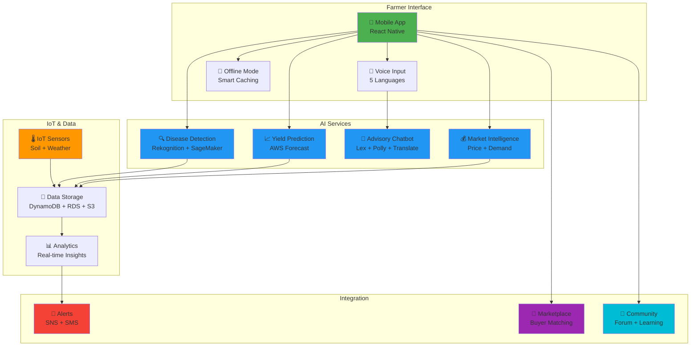
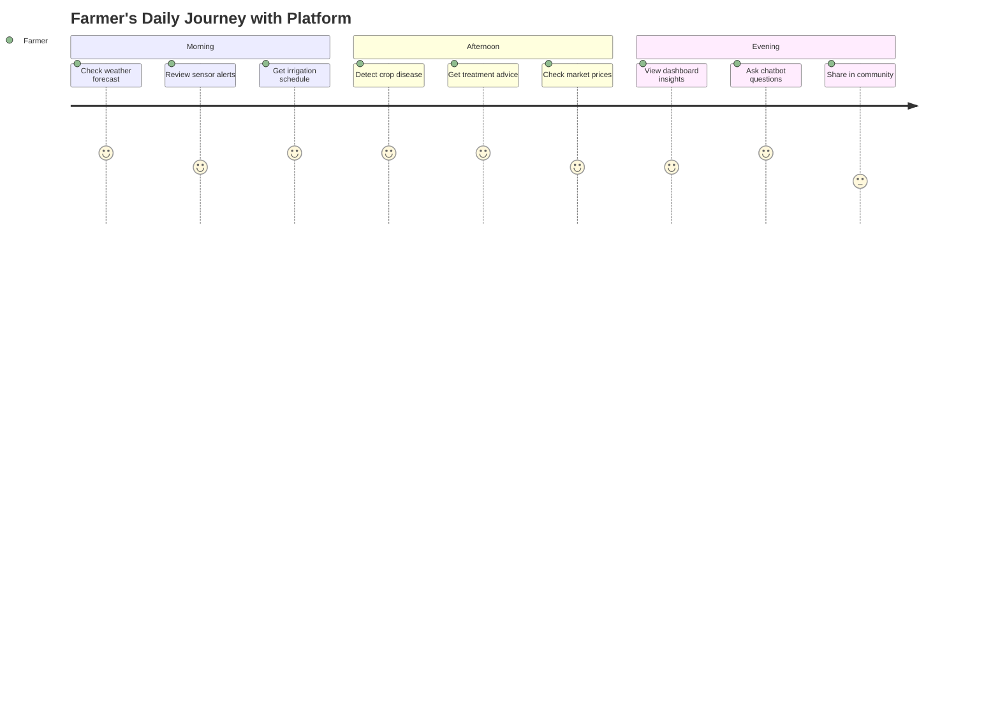
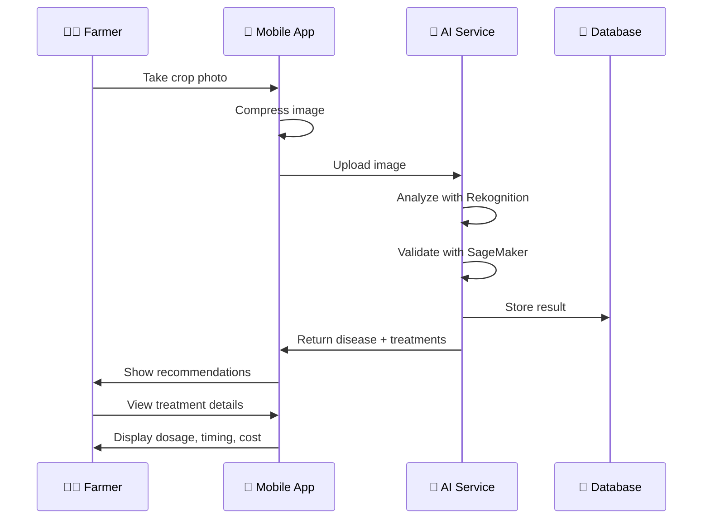
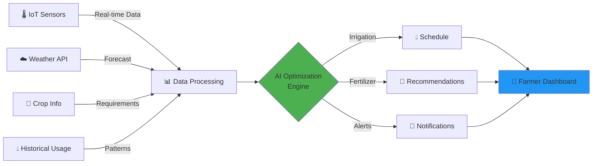
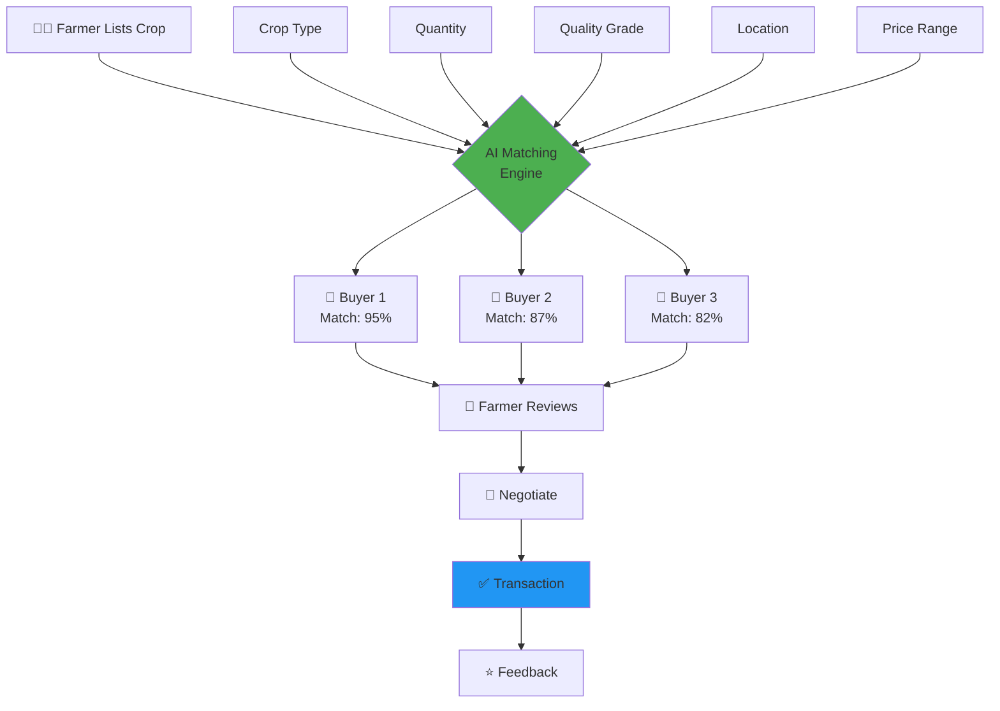
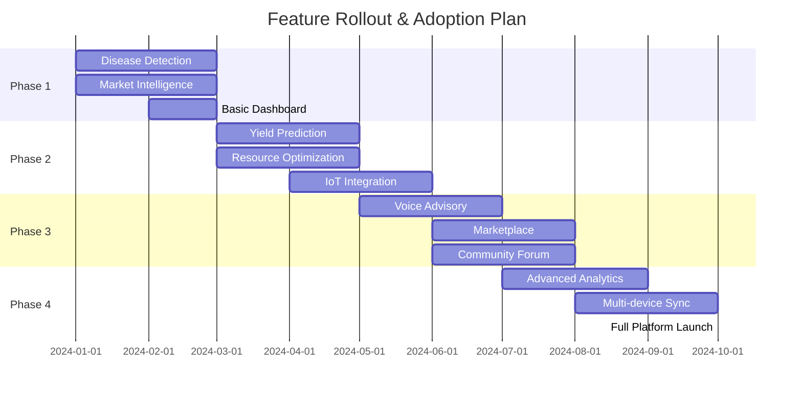
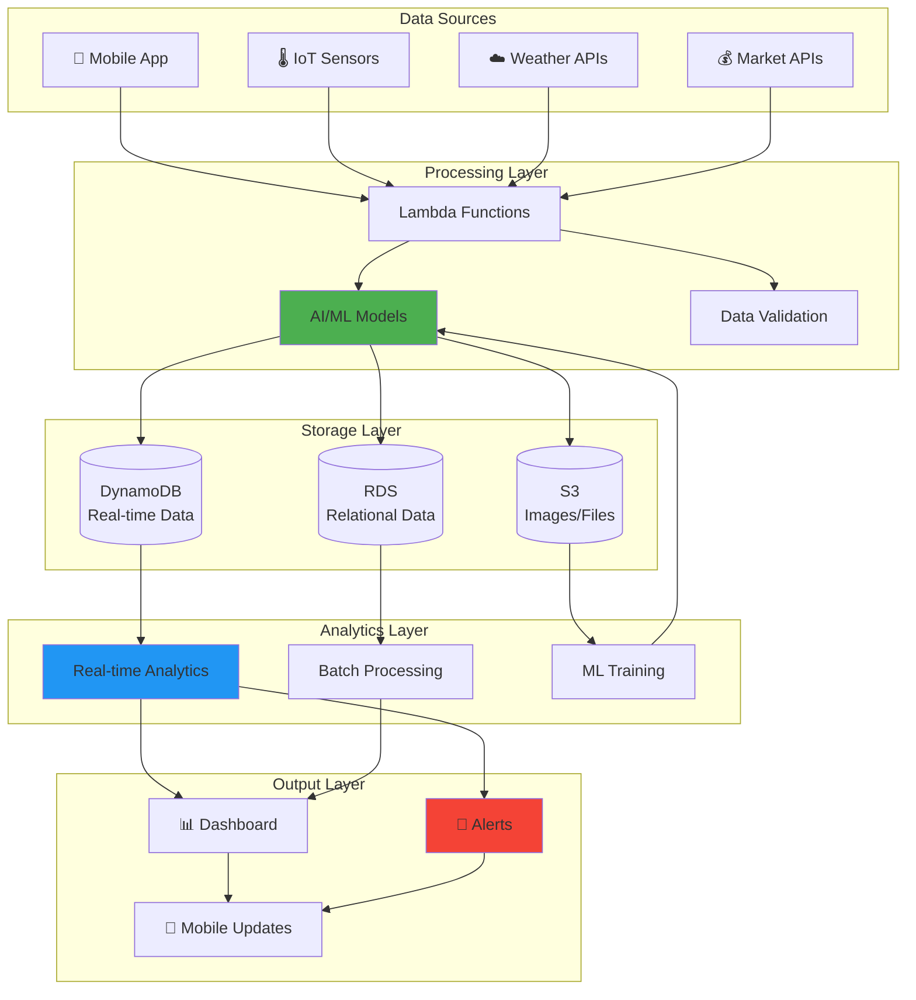
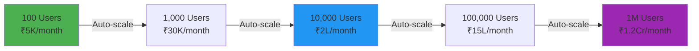

# Features & Visual Guide
## AI Rural Innovation Platform

---

## Complete Feature List

### 🌾 **Core Agricultural Intelligence Features**

#### 1. **Smart Crop Disease Detection**
- **Image-based disease identification** using AI (AWS Rekognition + SageMaker)
- **90%+ accuracy** across 20+ common crop diseases
- **Instant treatment recommendations** with dosage and timing
- **Organic and chemical alternatives** with cost-benefit analysis
- **Disease history tracking** with location metadata
- **2-second response time** for real-time decisions

#### 2. **AI-Powered Yield Prediction**
- **30+ days advance forecasting** before harvest
- **Confidence intervals** for prediction accuracy
- **Multi-factor analysis**: weather, soil, sensors, historical data
- **Automatic updates** when new sensor data arrives
- **Version tracking** for prediction changes
- **Alert system** for significant prediction changes (>10%)

#### 3. **Real-Time Market Intelligence**
- **Live price updates** from 5+ nearby markets (every 6 hours)
- **30-day demand forecasting** for crop planning
- **Price comparison** across multiple markets
- **Price alert system** with custom thresholds
- **Historical price trends** for better decision-making
- **Market accessibility** within 2-second response time

#### 4. **Resource Optimization Engine**
- **Smart irrigation scheduling** based on soil moisture and weather
- **30%+ water conservation** through AI optimization
- **Precision fertilizer recommendations** (NPK ratios, quantities, timing)
- **Organic and chemical alternatives** with cost analysis
- **Resource usage tracking** with efficiency metrics
- **Automated adjustments** based on weather forecasts

#### 5. **Multilingual Voice Advisory System**
- **5 regional languages**: Hindi, Tamil, Telugu, Bengali, Marathi
- **Voice input and output** for low-literacy accessibility
- **3-second response time** for natural conversations
- **Context-aware responses** based on farm history
- **24/7 availability** with AI chatbot
- **Human expert escalation** for complex queries

#### 6. **IoT Sensor Integration**
- **Real-time monitoring**: soil moisture, temperature, humidity, pH, NPK
- **30-second data processing** from sensor to platform
- **Threshold-based alerts** for critical conditions
- **Historical trend visualization** on dashboard
- **Connectivity monitoring** with offline alerts
- **Automated data aggregation** for analytics

---

### 📱 **Mobile & Connectivity Features**

#### 7. **Offline-First Mobile App**
- **Full offline functionality** with intelligent caching
- **Critical data prioritization** (disease guides, treatment protocols)
- **Automatic synchronization** when connectivity returns
- **Conflict resolution** for offline changes
- **Queue management** for offline operations
- **Clear offline mode indicators** in UI

#### 8. **Multi-Device Synchronization**
- **Cross-device data sync** (phones, tablets, shared devices)
- **Real-time consistency** across all devices (30-second propagation)
- **Concurrent access support** without data corruption
- **Remote logout** for lost/stolen devices
- **Device-specific offline caches** with conflict resolution

---

### 🔔 **Alert & Notification Features**

#### 9. **Intelligent Alert System**
- **Multi-channel delivery**: push notifications, SMS, in-app
- **24+ hour advance weather alerts** for severe conditions
- **Actionable recommendations** specific to crops and location
- **Priority-based delivery** (critical, high, medium, low)
- **Customizable preferences** (types, frequency, channels)
- **Rate limiting** to prevent alert fatigue (max 5/day)
- **Delivery tracking** with automatic retry

#### 10. **Weather Integration**
- **7-day forecasts** with 3-hour refresh cycles
- **Comprehensive data**: temperature, rainfall, humidity, wind
- **Severe weather alerts** with crop protection advice
- **Visual indicators** for favorable/unfavorable conditions
- **Weather-yield correlation** for improved predictions
- **Irrigation adjustments** based on rain forecasts

---

### 💰 **Marketplace & Economic Features**

#### 11. **Direct Farmer-to-Buyer Marketplace**
- **AI-powered buyer matching** based on crop, quality, location, quantity
- **Eliminate middlemen** for 25-35% income increase
- **Listing management** with price, quantity, delivery preferences
- **Communication facilitation** between farmers and buyers
- **Buyer ratings and reviews** for trust building
- **Transaction tracking** with income analytics

#### 12. **Income Analytics Dashboard**
- **Transaction history** with detailed records
- **Income projections** based on yield predictions
- **Cost tracking** for inputs (seeds, fertilizer, pesticides)
- **Profit margin analysis** per crop and season
- **Comparison views** against historical performance
- **Export capabilities** for financial planning

---

### 📊 **Analytics & Insights Features**

#### 13. **Visual Analytics Dashboard**
- **Key metrics display**: crop health, resource usage, yield trends, income
- **2-second load time** for all visualizations
- **Historical comparisons** against previous seasons
- **Weekly summary reports** with achievements and recommendations
- **Filtering capabilities**: date range, crop type, metric category
- **Low-literacy friendly** with icons, colors, and simple charts

#### 14. **Soil Health Tracking**
- **Soil test result storage** with timestamp and location
- **Multi-season trend analysis** for fertility tracking
- **Crop rotation recommendations** based on nutrient levels
- **Degradation alerts** with remediation suggestions
- **IoT sensor integration** for automatic capture
- **Color-coded health indicators** on dashboard

---

### 🎓 **Knowledge & Community Features**

#### 15. **Searchable Knowledge Base**
- **1000+ articles, videos, guides** on agricultural topics
- **2-second search results** ranked by relevance
- **Multilingual content** in all 5 supported languages
- **Seasonal farming advice** with regular updates
- **Outbreak advisories** for timely pest/disease information
- **Usage tracking** to identify knowledge gaps

#### 16. **Community Forum**
- **Peer-to-peer knowledge sharing** with Q&A
- **Photo and video sharing** for visual learning
- **Targeted notifications** based on crop type and location
- **Content moderation** to prevent misinformation
- **Expert farmer highlighting** for credible advice
- **Regional language support** for inclusive participation

---

### 🔒 **Security & Privacy Features**

#### 17. **Enterprise-Grade Security**
- **TLS 1.2+ encryption** for all data in transit
- **At-rest encryption** for S3, DynamoDB, RDS
- **Secure authentication** with password complexity requirements
- **Role-based access control** (RBAC) for data protection
- **Explicit consent** for data collection with privacy policy
- **Data export and deletion** on user request

#### 18. **System Reliability**
- **99.5%+ uptime** guarantee
- **Auto-scaling** for 10,000+ concurrent users
- **2-second response time** for 95% of requests
- **Comprehensive error logging** with CloudWatch
- **Critical error alerts** within 5 minutes
- **Request tracing** with correlation IDs

---

### 🌱 **Advanced Agricultural Features**

#### 19. **Fertilizer & Pesticide Management**
- **Precise fertilizer calculations** based on soil health and crop stage
- **Application window alerts** based on weather and growth stage
- **Pesticide recommendations** with dosage, timing, safety precautions
- **Regulatory compliance** validation for chemical usage
- **Usage efficiency tracking** over time
- **Cost optimization** through precise recommendations

#### 20. **Admin Analytics & Reporting**
- **KPI tracking**: user adoption, feature usage, yield improvements, income increases
- **Monthly impact reports** showing platform effectiveness
- **Geographic analytics** for regional insights
- **Model performance metrics** (accuracy, prediction errors)
- **Feature utilization analysis** to identify improvements
- **Data export** in CSV, JSON, Excel formats

---

## Visual Representations

### 1. Platform Architecture Overview



### 2. User Journey Flow



### 3. Feature Categories Breakdown

```
┌─────────────────────────────────────────────────────────────┐
│         AI RURAL INNOVATION PLATFORM - FEATURES             │
├─────────────────────────────────────────────────────────────┤
│                                                             │
│  🌾 SMART AGRICULTURE (6 features)                         │
│  ├─ Disease Detection                                      │
│  ├─ Yield Prediction                                       │
│  ├─ Market Intelligence                                    │
│  ├─ Resource Optimization                                  │
│  ├─ Fertilizer Management                                  │
│  └─ Soil Health Tracking                                   │
│                                                             │
│  🎤 ACCESSIBILITY (3 features)                             │
│  ├─ Multilingual Voice Interface                           │
│  ├─ Offline-First Mobile App                               │
│  └─ Multi-Device Sync                                      │
│                                                             │
│  🔔 ALERTS & MONITORING (3 features)                       │
│  ├─ Intelligent Alert System                               │
│  ├─ Weather Integration                                    │
│  └─ IoT Sensor Integration                                 │
│                                                             │
│  💰 MARKETPLACE (2 features)                               │
│  ├─ Farmer-to-Buyer Platform                               │
│  └─ Income Analytics                                       │
│                                                             │
│  📊 INSIGHTS (2 features)                                  │
│  ├─ Visual Dashboard                                       │
│  └─ Admin Analytics                                        │
│                                                             │
│  🎓 LEARNING (2 features)                                  │
│  ├─ Knowledge Base                                         │
│  └─ Community Forum                                        │
│                                                             │
│  🔒 SECURITY (2 features)                                  │
│  ├─ Enterprise Security                                    │
│  └─ System Reliability                                     │
│                                                             │
│  TOTAL: 20 MAJOR FEATURES                                  │
└─────────────────────────────────────────────────────────────┘
```


### 4. Disease Detection Workflow



### 5. Resource Optimization Flow



### 6. Offline-First Architecture

```
┌──────────────────────────────────────────────────────────┐
│                    ONLINE MODE                           │
├──────────────────────────────────────────────────────────┤
│                                                          │
│  📱 Mobile App  ←──────→  ☁️ Cloud Services            │
│                                                          │
│  ✓ Real-time sync                                       │
│  ✓ Live data updates                                    │
│  ✓ Full feature access                                  │
│                                                          │
└──────────────────────────────────────────────────────────┘

                         ↕️
                    Connection Lost
                         ↕️

┌──────────────────────────────────────────────────────────┐
│                   OFFLINE MODE                           │
├──────────────────────────────────────────────────────────┤
│                                                          │
│  📱 Mobile App  ←──────→  💾 Local Cache                │
│                                                          │
│  ✓ Disease identification guides                        │
│  ✓ Treatment protocols                                  │
│  ✓ Recent market prices                                 │
│  ✓ Crop information                                     │
│  ✓ Queue operations for sync                            │
│                                                          │
└──────────────────────────────────────────────────────────┘

                         ↕️
                   Connection Restored
                         ↕️

┌──────────────────────────────────────────────────────────┐
│                 AUTO-SYNC MODE                           │
├──────────────────────────────────────────────────────────┤
│                                                          │
│  📱 Mobile App  ←──────→  ☁️ Cloud Services            │
│                                                          │
│  ⬆️ Upload queued operations                            │
│  ⬇️ Download latest updates                             │
│  🔄 Resolve conflicts                                    │
│  ✓ Notify user of changes                               │
│                                                          │
└──────────────────────────────────────────────────────────┘
```

### 7. Marketplace Matching Algorithm



### 8. Voice Advisory System Flow

```
┌─────────────────────────────────────────────────────────┐
│                                                         │
│  👨‍🌾 Farmer speaks in regional language                │
│                                                         │
│         "मेरी गेहूं की फसल पीली हो रही है"            │
│         (My wheat crop is turning yellow)              │
│                    ↓                                    │
│              🎤 Voice Input                             │
│                    ↓                                    │
│         📝 Transcribe (AWS Transcribe)                  │
│                    ↓                                    │
│         🧠 Understand Intent (AWS Lex)                  │
│                    ↓                                    │
│         🔍 Search Knowledge Base (Kendra)               │
│                    ↓                                    │
│         💡 Generate Response (AI + Context)             │
│                    ↓                                    │
│         🗣️ Text-to-Speech (AWS Polly)                  │
│                    ↓                                    │
│         🔊 Audio Response                               │
│                                                         │
│  "यह नाइट्रोजन की कमी हो सकती है। मैं आपको           │
│   उर्वरक की सिफारिशें भेज रहा हूं।"                   │
│  (This could be nitrogen deficiency. I'm sending       │
│   you fertilizer recommendations.)                     │
│                                                         │
│         ⏱️ Total Time: < 3 seconds                      │
│                                                         │
└─────────────────────────────────────────────────────────┘
```

### 9. Impact Metrics Visualization

```
┌────────────────────────────────────────────────────────────┐
│              PLATFORM IMPACT METRICS                       │
├────────────────────────────────────────────────────────────┤
│                                                            │
│  💰 INCOME INCREASE                                        │
│  ████████████████████████░░░░░░░░  +25-35%                │
│                                                            │
│  🌾 YIELD IMPROVEMENT                                      │
│  ██████████████████░░░░░░░░░░░░░░  +15-20%                │
│                                                            │
│  💧 WATER CONSERVATION                                     │
│  ████████████████████████████░░░░  +30%                   │
│                                                            │
│  🌱 INPUT COST REDUCTION                                   │
│  ████████████████████░░░░░░░░░░░  +20-25%                 │
│                                                            │
│  ⚠️ CROP LOSS REDUCTION                                    │
│  ████████████████████████████████  -40-50%                │
│                                                            │
│  ⏱️ DECISION TIME                                          │
│  ██░░░░░░░░░░░░░░░░░░░░░░░░░░░░░  2 sec vs 3-7 days      │
│                                                            │
│  🎯 DISEASE DETECTION ACCURACY                             │
│  █████████████████████████████░░░  90%+                   │
│                                                            │
│  📱 USER ACCESSIBILITY                                     │
│  ████████████████████████████░░░░  80%+ (voice enabled)   │
│                                                            │
└────────────────────────────────────────────────────────────┘
```

### 10. Technology Stack Visualization

```
┌─────────────────────────────────────────────────────────────┐
│                    TECHNOLOGY STACK                         │
├─────────────────────────────────────────────────────────────┤
│                                                             │
│  📱 FRONTEND                                                │
│  ┌─────────────────────────────────────────────────────┐   │
│  │  React Native  │  Offline Storage  │  Voice UI      │   │
│  └─────────────────────────────────────────────────────┘   │
│                                                             │
│  🔌 API LAYER                                               │
│  ┌─────────────────────────────────────────────────────┐   │
│  │  API Gateway  │  Cognito Auth  │  Lambda Functions  │   │
│  └─────────────────────────────────────────────────────┘   │
│                                                             │
│  🤖 AI SERVICES                                             │
│  ┌─────────────────────────────────────────────────────┐   │
│  │  Rekognition  │  Forecast  │  SageMaker  │  Lex     │   │
│  │  Comprehend   │  Polly     │  Translate  │  Kendra  │   │
│  └─────────────────────────────────────────────────────┘   │
│                                                             │
│  💾 DATA LAYER                                              │
│  ┌─────────────────────────────────────────────────────┐   │
│  │  DynamoDB  │  RDS PostgreSQL  │  S3  │  ElastiCache │   │
│  └─────────────────────────────────────────────────────┘   │
│                                                             │
│  🌐 IoT & INTEGRATION                                       │
│  ┌─────────────────────────────────────────────────────┐   │
│  │  IoT Core  │  EventBridge  │  SNS  │  SQS          │   │
│  └─────────────────────────────────────────────────────┘   │
│                                                             │
│  📊 MONITORING                                              │
│  ┌─────────────────────────────────────────────────────┐   │
│  │  CloudWatch  │  X-Ray  │  CloudTrail                │   │
│  └─────────────────────────────────────────────────────┘   │
│                                                             │
└─────────────────────────────────────────────────────────────┘
```

### 11. Feature Adoption Timeline



### 12. User Persona & Feature Mapping

```
┌──────────────────────────────────────────────────────────────┐
│                    USER PERSONAS                             │
├──────────────────────────────────────────────────────────────┤
│                                                              │
│  👨‍🌾 SMALL FARMER (1-5 acres)                               │
│  Primary Needs: Disease detection, Weather alerts,          │
│                 Market prices, Voice advisory                │
│  Key Features: ✓ Disease Detection                          │
│                ✓ Weather Integration                         │
│                ✓ Market Intelligence                         │
│                ✓ Voice Advisory                              │
│                ✓ Offline Mode                                │
│                                                              │
│  👨‍🌾 MEDIUM FARMER (5-20 acres)                             │
│  Primary Needs: Yield prediction, Resource optimization,    │
│                 Marketplace, Analytics                       │
│  Key Features: ✓ All Small Farmer features                  │
│                ✓ Yield Prediction                            │
│                ✓ Resource Optimization                       │
│                ✓ IoT Sensors                                 │
│                ✓ Marketplace                                 │
│                ✓ Dashboard Analytics                         │
│                                                              │
│  👨‍🌾 PROGRESSIVE FARMER (20+ acres)                         │
│  Primary Needs: Advanced analytics, Soil tracking,          │
│                 Community leadership, Full automation        │
│  Key Features: ✓ All Medium Farmer features                 │
│                ✓ Soil Health Tracking                        │
│                ✓ Advanced Analytics                          │
│                ✓ Community Forum (Expert)                    │
│                ✓ Multi-device Sync                           │
│                ✓ Admin Dashboard                             │
│                                                              │
└──────────────────────────────────────────────────────────────┘
```

### 13. Data Flow Architecture



### 14. Security Architecture

```
┌─────────────────────────────────────────────────────────────┐
│                    SECURITY LAYERS                          │
├─────────────────────────────────────────────────────────────┤
│                                                             │
│  🔒 LAYER 1: NETWORK SECURITY                              │
│  ├─ TLS 1.2+ Encryption (Data in Transit)                  │
│  ├─ VPC Isolation                                          │
│  ├─ Security Groups & NACLs                                │
│  └─ DDoS Protection (AWS Shield)                           │
│                                                             │
│  🔐 LAYER 2: AUTHENTICATION & AUTHORIZATION                │
│  ├─ AWS Cognito User Pools                                 │
│  ├─ Multi-Factor Authentication (MFA)                      │
│  ├─ Role-Based Access Control (RBAC)                       │
│  └─ JWT Token Management                                   │
│                                                             │
│  🛡️ LAYER 3: DATA PROTECTION                               │
│  ├─ Encryption at Rest (S3, DynamoDB, RDS)                │
│  ├─ KMS Key Management                                     │
│  ├─ Data Masking for PII                                   │
│  └─ Backup & Disaster Recovery                             │
│                                                             │
│  📋 LAYER 4: COMPLIANCE & PRIVACY                          │
│  ├─ GDPR Compliance                                        │
│  ├─ Data Retention Policies                                │
│  ├─ User Consent Management                                │
│  └─ Right to be Forgotten                                  │
│                                                             │
│  🔍 LAYER 5: MONITORING & AUDIT                            │
│  ├─ CloudWatch Logging                                     │
│  ├─ CloudTrail Audit Logs                                  │
│  ├─ Security Alerts                                        │
│  └─ Anomaly Detection                                      │
│                                                             │
└─────────────────────────────────────────────────────────────┘
```


### 15. Cost Optimization Strategy

```
┌─────────────────────────────────────────────────────────────┐
│              COST OPTIMIZATION APPROACH                     │
├─────────────────────────────────────────────────────────────┤
│                                                             │
│  💰 SERVERLESS ARCHITECTURE                                │
│  ┌───────────────────────────────────────────────────┐     │
│  │  Pay only for actual usage                        │     │
│  │  No idle server costs                             │     │
│  │  Automatic scaling (0 to 100K users)              │     │
│  │  Estimated: ₹50-100 per farmer per year           │     │
│  └───────────────────────────────────────────────────┘     │
│                                                             │
│  📦 DATA LIFECYCLE MANAGEMENT                              │
│  ┌───────────────────────────────────────────────────┐     │
│  │  Hot Data (DynamoDB): 30 days                     │     │
│  │  Warm Data (S3 Standard): 30-90 days              │     │
│  │  Cold Data (S3 Glacier): 90+ days                 │     │
│  │  Cost Savings: 70% on storage                     │     │
│  └───────────────────────────────────────────────────┘     │
│                                                             │
│  🎯 SMART CACHING                                          │
│  ┌───────────────────────────────────────────────────┐     │
│  │  ElastiCache for frequent queries                 │     │
│  │  DynamoDB DAX for hot data                        │     │
│  │  CloudFront CDN for static assets                 │     │
│  │  Cost Savings: 60% on API calls                   │     │
│  └───────────────────────────────────────────────────┘     │
│                                                             │
│  🔄 RESOURCE OPTIMIZATION                                  │
│  ┌───────────────────────────────────────────────────┐     │
│  │  Lambda memory optimization                       │     │
│  │  Reserved capacity for predictable loads          │     │
│  │  Spot instances for batch processing              │     │
│  │  Cost Savings: 40% on compute                     │     │
│  └───────────────────────────────────────────────────┘     │
│                                                             │
│  📊 TOTAL COST EFFICIENCY                                  │
│  ┌───────────────────────────────────────────────────┐     │
│  │  Traditional Infrastructure: ₹500-1000/farmer/yr  │     │
│  │  Our Serverless Approach: ₹50-100/farmer/yr       │     │
│  │  Cost Reduction: 80-90%                           │     │
│  └───────────────────────────────────────────────────┘     │
│                                                             │
└─────────────────────────────────────────────────────────────┘
```

### 16. Scalability Model



### 17. Feature Priority Matrix

```
                    HIGH IMPACT
                         ↑
                         │
    ┌────────────────────┼────────────────────┐
    │                    │                    │
    │  🔥 QUICK WINS     │  💎 STRATEGIC      │
    │                    │                    │
    │  • Disease         │  • Yield           │
    │    Detection       │    Prediction      │
    │  • Weather         │  • IoT             │
    │    Alerts          │    Integration     │
    │  • Market          │  • Marketplace     │
    │    Prices          │                    │
    │                    │                    │
LOW ├────────────────────┼────────────────────┤ HIGH
EFFORT                   │                  EFFORT
    │                    │                    │
    │  📋 FILL-INS       │  ⚠️ AVOID          │
    │                    │                    │
    │  • Knowledge       │  • Complex         │
    │    Base            │    Integrations    │
    │  • Community       │  • Nice-to-have    │
    │    Forum           │    Features        │
    │                    │                    │
    └────────────────────┼────────────────────┘
                         │
                         ↓
                    LOW IMPACT
```

### 18. Integration Ecosystem

```
┌─────────────────────────────────────────────────────────────┐
│              EXTERNAL INTEGRATIONS                          │
├─────────────────────────────────────────────────────────────┤
│                                                             │
│  🌦️ WEATHER DATA PROVIDERS                                 │
│  ├─ India Meteorological Department (IMD)                  │
│  ├─ OpenWeatherMap API                                     │
│  └─ AccuWeather API                                        │
│                                                             │
│  💰 MARKET DATA SOURCES                                    │
│  ├─ AGMARKNET (Government Portal)                          │
│  ├─ State Agricultural Marketing Boards                    │
│  ├─ Commodity Exchanges (NCDEX, MCX)                       │
│  └─ Local Mandi Price APIs                                 │
│                                                             │
│  🌡️ IoT DEVICE PARTNERS                                    │
│  ├─ Soil Moisture Sensors                                  │
│  ├─ Weather Stations                                       │
│  ├─ pH & NPK Sensors                                       │
│  └─ Smart Irrigation Controllers                           │
│                                                             │
│  📱 COMMUNICATION CHANNELS                                 │
│  ├─ SMS Gateway (Twilio/AWS SNS)                           │
│  ├─ Push Notifications (Firebase)                          │
│  ├─ WhatsApp Business API                                  │
│  └─ Voice Calls (Amazon Connect)                           │
│                                                             │
│  💳 PAYMENT GATEWAYS                                       │
│  ├─ Razorpay                                               │
│  ├─ Paytm                                                  │
│  ├─ UPI Integration                                        │
│  └─ Bank Transfer APIs                                     │
│                                                             │
│  🏛️ GOVERNMENT SYSTEMS                                     │
│  ├─ PM-KISAN Database                                      │
│  ├─ Soil Health Card Portal                                │
│  ├─ Kisan Call Center                                      │
│  └─ Agricultural Census Data                               │
│                                                             │
└─────────────────────────────────────────────────────────────┘
```

### 19. Mobile App Screen Flow

```
┌─────────────────────────────────────────────────────────────┐
│                    MOBILE APP SCREENS                       │
├─────────────────────────────────────────────────────────────┤
│                                                             │
│  📱 LOGIN/ONBOARDING                                       │
│  ├─ Language Selection (5 languages)                       │
│  ├─ Phone Number Verification                              │
│  ├─ Farm Profile Setup                                     │
│  └─ Tutorial Walkthrough                                   │
│                                                             │
│  🏠 HOME DASHBOARD                                         │
│  ├─ Weather Widget (7-day forecast)                        │
│  ├─ Quick Actions (Disease Detection, Market Prices)       │
│  ├─ Recent Alerts (3 most recent)                          │
│  ├─ Crop Health Score                                      │
│  └─ Voice Assistant Button                                 │
│                                                             │
│  🔍 DISEASE DETECTION                                      │
│  ├─ Camera Interface                                       │
│  ├─ Image Preview & Crop Selection                         │
│  ├─ Analysis Progress                                      │
│  ├─ Disease Results                                        │
│  └─ Treatment Recommendations                              │
│                                                             │
│  📈 YIELD PREDICTION                                       │
│  ├─ Current Season Prediction                              │
│  ├─ Confidence Interval Chart                              │
│  ├─ Contributing Factors                                   │
│  └─ Historical Comparison                                  │
│                                                             │
│  💰 MARKET INTELLIGENCE                                    │
│  ├─ Current Prices (5+ markets)                            │
│  ├─ Price Trends Graph                                     │
│  ├─ Demand Forecast                                        │
│  └─ Price Alert Setup                                      │
│                                                             │
│  💧 RESOURCE MANAGEMENT                                    │
│  ├─ Irrigation Schedule                                    │
│  ├─ Fertilizer Recommendations                             │
│  ├─ Usage Tracking                                         │
│  └─ Efficiency Metrics                                     │
│                                                             │
│  🎤 VOICE ADVISORY                                         │
│  ├─ Voice Input Interface                                  │
│  ├─ Conversation History                                   │
│  ├─ Quick Questions                                        │
│  └─ Expert Escalation                                      │
│                                                             │
│  🛒 MARKETPLACE                                            │
│  ├─ Create Listing                                         │
│  ├─ Browse Buyers                                          │
│  ├─ Negotiations                                           │
│  └─ Transaction History                                    │
│                                                             │
│  👥 COMMUNITY                                              │
│  ├─ Forum Feed                                             │
│  ├─ Post Question/Story                                    │
│  ├─ Expert Farmers                                         │
│  └─ Success Stories                                        │
│                                                             │
│  📚 KNOWLEDGE BASE                                         │
│  ├─ Search Interface                                       │
│  ├─ Categories (Crops, Pests, Weather, etc.)               │
│  ├─ Articles & Videos                                      │
│  └─ Bookmarks                                              │
│                                                             │
│  ⚙️ SETTINGS                                               │
│  ├─ Profile Management                                     │
│  ├─ Farm Details                                           │
│  ├─ Alert Preferences                                      │
│  ├─ Language Settings                                      │
│  └─ Privacy & Security                                     │
│                                                             │
└─────────────────────────────────────────────────────────────┘
```

### 20. Success Metrics Dashboard

```
┌─────────────────────────────────────────────────────────────┐
│              PLATFORM SUCCESS METRICS                       │
├─────────────────────────────────────────────────────────────┤
│                                                             │
│  USER METRICS                                               │
│  ┌───────────────────────────────────────────────────┐     │
│  │  Total Users:        10,000 ████████░░  Target    │     │
│  │  Active Users:        8,500 ███████░░░  85%       │     │
│  │  Retention (3mo):     8,000 ███████░░░  80%       │     │
│  │  Daily Active:        3,500 ████░░░░░░  35%       │     │
│  └───────────────────────────────────────────────────┘     │
│                                                             │
│  ENGAGEMENT METRICS                                         │
│  ┌───────────────────────────────────────────────────┐     │
│  │  Disease Scans/Day:   2,500 ████████░░  High      │     │
│  │  Voice Queries/Day:   5,000 █████████░  Very High │     │
│  │  Market Checks/Day:   7,500 ██████████  Excellent │     │
│  │  Forum Posts/Day:       500 ███░░░░░░░  Growing   │     │
│  └───────────────────────────────────────────────────┘     │
│                                                             │
│  IMPACT METRICS                                             │
│  ┌───────────────────────────────────────────────────┐     │
│  │  Avg Income Increase:  +30% ████████░░  ₹45K/yr   │     │
│  │  Yield Improvement:    +18% ██████░░░░  Good      │     │
│  │  Water Saved:          +32% ████████░░  Excellent │     │
│  │  Cost Reduction:       +23% ███████░░░  Strong    │     │
│  └───────────────────────────────────────────────────┘     │
│                                                             │
│  TECHNICAL METRICS                                          │
│  ┌───────────────────────────────────────────────────┐     │
│  │  Uptime:            99.7% ██████████  Excellent   │     │
│  │  Avg Response:      1.8s  █████████░  Fast        │     │
│  │  Error Rate:        0.3%  █░░░░░░░░░  Very Low    │     │
│  │  AI Accuracy:       92%   █████████░  High        │     │
│  └───────────────────────────────────────────────────┘     │
│                                                             │
│  BUSINESS METRICS                                           │
│  ┌───────────────────────────────────────────────────┐     │
│  │  Revenue:           ₹2.5Cr ███████░░░  On Track   │     │
│  │  Cost per User:     ₹75    ████░░░░░░  Optimized  │     │
│  │  Marketplace GMV:   ₹50Cr  ████████░░  Growing    │     │
│  │  Customer Sat:      4.6/5  █████████░  Excellent  │     │
│  └───────────────────────────────────────────────────┘     │
│                                                             │
└─────────────────────────────────────────────────────────────┘
```

---

## Summary: 20 Major Features Across 7 Categories

### Quick Reference Table

| Category | Features | Key Benefits |
|----------|----------|--------------|
| **🌾 Smart Agriculture** | 6 features | Disease detection, yield prediction, market intelligence, resource optimization, fertilizer management, soil tracking |
| **🎤 Accessibility** | 3 features | Voice interface (5 languages), offline mode, multi-device sync |
| **🔔 Alerts & Monitoring** | 3 features | Intelligent alerts, weather integration, IoT sensors |
| **💰 Marketplace** | 2 features | Farmer-to-buyer platform, income analytics |
| **📊 Insights** | 2 features | Visual dashboard, admin analytics |
| **🎓 Learning** | 2 features | Knowledge base, community forum |
| **🔒 Security** | 2 features | Enterprise security, system reliability |

---

## Presentation Tips

### For Slides:
1. Use the **Platform Architecture Overview** diagram on slide 2-3
2. Include the **Feature Categories Breakdown** ASCII art for quick overview
3. Show **Impact Metrics Visualization** to demonstrate value
4. Use **User Journey Flow** to tell a story
5. Display **Technology Stack** to show technical depth

### For Demo:
1. Start with **Disease Detection Workflow** - most visual and impressive
2. Show **Voice Advisory System** - demonstrates accessibility
3. Demonstrate **Offline Mode** - unique differentiator
4. Walk through **Mobile App Screen Flow** - user experience
5. End with **Success Metrics Dashboard** - impact and scale

### For Technical Audience:
1. Focus on **Data Flow Architecture**
2. Explain **Security Architecture** layers
3. Show **Scalability Model** and cost efficiency
4. Discuss **Integration Ecosystem**
5. Present **Technology Stack** in detail

---

**Total Features: 20 Major Features | 100+ Sub-features | 120 Acceptance Criteria**

This comprehensive platform transforms rural agriculture through AI, making advanced technology accessible, affordable, and effective for smallholder farmers across India.
