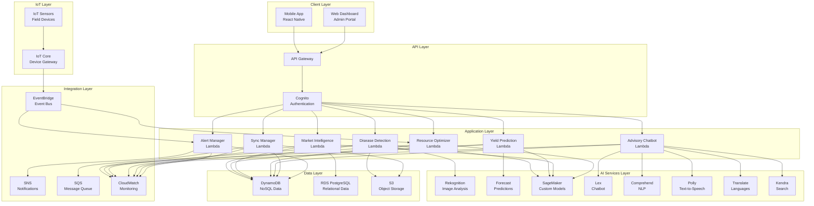

# Design Document: AI Rural Innovation Platform

## Overview

The AI Rural Innovation Platform is a comprehensive serverless system built on AWS that empowers rural farmers through AI-driven agricultural intelligence, market connectivity, and resource optimization. The platform leverages AWS AI services (Rekognition, Forecast, SageMaker, Lex, Comprehend, Polly, Translate, Kendra) integrated with IoT sensors, mobile applications, and backend services to deliver real-time insights and recommendations.

The system architecture follows a serverless, event-driven design using AWS Lambda for compute, API Gateway for API management, DynamoDB and RDS for data storage, S3 for object storage, and IoT Core for sensor integration. The React Native mobile application provides an offline-first experience with intelligent synchronization.

Key design principles:
- **Serverless-first**: Minimize operational overhead and enable automatic scaling
- **Offline-first**: Ensure functionality in areas with poor connectivity
- **Multilingual**: Support 5 regional languages (Hindi, Tamil, Telugu, Bengali, Marathi)
- **AI-driven**: Leverage AWS AI services for intelligent decision support
- **Event-driven**: Use asynchronous processing for scalability and resilience
- **Security-first**: Implement encryption, authentication, and access control throughout

## Architecture

### High-Level Architecture



### Component Architecture

The system is organized into distinct modules, each responsible for specific functionality:

1. **Smart Agriculture Module**: Handles crop disease detection, yield prediction, and agricultural recommendations
2. **Market Intelligence Module**: Manages pricing data, demand forecasting, and farmer-buyer connections
3. **Resource Management Module**: Optimizes water, fertilizer, and energy usage based on IoT sensor data
4. **Advisory Module**: Provides multilingual conversational AI support via voice and text
5. **Synchronization Module**: Manages offline data caching and bidirectional sync
6. **Alert Module**: Delivers timely notifications via push, SMS, and in-app channels
7. **Analytics Module**: Generates insights, dashboards, and reports

### Data Flow Patterns

**Synchronous Flow (Real-time Requests)**:
```
Mobile App → API Gateway → Lambda → AI Service → Lambda → Response
```

**Asynchronous Flow (Background Processing)**:
```
IoT Sensor → IoT Core → EventBridge → Lambda → DynamoDB → EventBridge → Alert Lambda → SNS
```

**Offline-to-Online Flow**:
```
Mobile App (Offline) → Local Cache → Network Restored → Sync Lambda → SQS → Processing Lambda → DynamoDB
```

## Components and Interfaces

### 1. Disease Detection Service

**Responsibility**: Analyze crop images to identify diseases and provide treatment recommendations.

**Interfaces**:
```python
class DiseaseDetectionService:
    def detect_disease(image: bytes, crop_type: str, location: Location) -> DiseaseResult:
        """
        Analyzes crop image for disease detection.
        
        Args:
            image: Raw image bytes (JPEG/PNG/HEIC)
            crop_type: Type of crop (e.g., "rice", "wheat")
            location: GPS coordinates of the farm
            
        Returns:
            DiseaseResult containing disease_name, confidence, treatments, and metadata
            
        Raises:
            InvalidImageError: If image quality is insufficient
            UnsupportedCropError: If crop type is not supported
        """
        
    def get_treatment_recommendations(disease_id: str, severity: str) -> List[Treatment]:
        """
        Retrieves treatment recommendations for identified disease.
        
        Args:
            disease_id: Unique identifier for the disease
            severity: Severity level ("low", "medium", "high")
            
        Returns:
            List of Treatment objects with pesticides, organic alternatives, and application instructions
        """
```

**Implementation Details**:
- Uses AWS Rekognition Custom Labels for initial image classification
- Falls back to SageMaker custom model for specialized disease detection
- Compresses images to 1024x1024 max resolution before processing
- Stores images in S3 with lifecycle policy (30 days standard, then Glacier)
- Caches common disease results in DynamoDB for faster retrieval
- Implements confidence threshold of 0.85 for automatic recommendations

### 2. Yield Prediction Service

**Responsibility**: Forecast crop yields based on historical data, weather, soil conditions, and IoT sensor inputs.

**Interfaces**:
```python
class YieldPredictionService:
    def predict_yield(farm_id: str, crop_type: str, season: str) -> YieldPrediction:
        """
        Generates yield prediction for specified farm and crop.
        
        Args:
            farm_id: Unique identifier for the farm
            crop_type: Type of crop being grown
            season: Growing season identifier
            
        Returns:
            YieldPrediction with estimated_yield, confidence_interval, factors, and recommendations
        """
        
    def update_prediction(prediction_id: str, sensor_data: SensorReading) -> YieldPrediction:
        """
        Updates existing prediction with new sensor data.
        
        Args:
            prediction_id: Identifier for existing prediction
            sensor_data: Latest IoT sensor readings
            
        Returns:
            Updated YieldPrediction
        """
```

**Implementation Details**:
- Uses AWS Forecast service with DeepAR+ algorithm for time-series prediction
- Trains models on historical yield data, weather patterns, soil health, and sensor readings
- Retrains models monthly with new data
- Incorporates real-time weather forecasts from external APIs
- Stores predictions in DynamoDB with version history
- Triggers alerts when predictions deviate >10% from previous estimates

### 3. Market Intelligence Service

**Responsibility**: Provide real-time market prices, demand forecasting, and buyer connections.

**Interfaces**:
```python
class MarketIntelligenceService:
    def get_market_prices(crop_type: str, location: Location, radius_km: int) -> List[MarketPrice]:
        """
        Retrieves current market prices for specified crop and location.
        
        Args:
            crop_type: Type of crop
            location: GPS coordinates
            radius_km: Search radius in kilometers
            
        Returns:
            List of MarketPrice objects from nearby markets
        """
        
    def forecast_demand(crop_type: str, region: str, days_ahead: int) -> DemandForecast:
        """
        Forecasts demand for specified crop and region.
        
        Args:
            crop_type: Type of crop
            region: Geographic region
            days_ahead: Number of days to forecast (max 30)
            
        Returns:
            DemandForecast with predicted demand levels and confidence
        """
        
    def match_buyers(listing: CropListing) -> List[BuyerMatch]:
        """
        Matches crop listing with potential buyers.
        
        Args:
            listing: CropListing with crop details, quantity, price, location
            
        Returns:
            List of BuyerMatch objects ranked by relevance
        """
```

**Implementation Details**:
- Scrapes market price data from government APIs and agricultural boards every 6 hours
- Stores price history in RDS PostgreSQL for time-series analysis
- Uses SageMaker for demand forecasting based on historical patterns and seasonal trends
- Implements buyer matching algorithm considering location, quantity, quality, and historical transactions
- Caches recent price queries in DynamoDB with 1-hour TTL
- Sends price alerts via SNS when thresholds are met

### 4. Resource Optimization Service

**Responsibility**: Optimize water, fertilizer, and energy usage based on IoT sensor data and crop requirements.

**Interfaces**:
```python
class ResourceOptimizationService:
    def calculate_irrigation_schedule(farm_id: str, crop_type: str, sensor_data: SensorReading, weather_forecast: WeatherData) -> IrrigationSchedule:
        """
        Calculates optimal irrigation schedule.
        
        Args:
            farm_id: Unique identifier for the farm
            crop_type: Type of crop
            sensor_data: Current soil moisture and environmental readings
            weather_forecast: 7-day weather forecast
            
        Returns:
            IrrigationSchedule with timing, duration, and water quantity
        """
        
    def recommend_fertilizer(soil_health: SoilHealthData, crop_type: str, growth_stage: str) -> FertilizerRecommendation:
        """
        Recommends fertilizer type and quantity.
        
        Args:
            soil_health: Soil nutrient levels and pH
            crop_type: Type of crop
            growth_stage: Current growth stage
            
        Returns:
            FertilizerRecommendation with NPK ratios, quantity, timing, and alternatives
        """
        
    def track_resource_usage(farm_id: str, resource_type: str, start_date: date, end_date: date) -> ResourceUsageReport:
        """
        Tracks resource usage over time period.
        
        Args:
            farm_id: Unique identifier for the farm
            resource_type: "water", "fertilizer", or "energy"
            start_date: Start of reporting period
            end_date: End of reporting period
            
        Returns:
            ResourceUsageReport with usage metrics, efficiency scores, and comparisons
        """
```

**Implementation Details**:
- Uses SageMaker model trained on crop water requirements and evapotranspiration data
- Integrates with IoT Core to receive real-time sensor data
- Implements rule-based system for fertilizer recommendations based on soil test results
- Adjusts irrigation schedules dynamically based on weather forecasts
- Stores resource usage data in DynamoDB for analytics
- Calculates efficiency metrics comparing actual vs. optimal usage

### 5. Advisory Chatbot Service

**Responsibility**: Provide multilingual conversational AI support via voice and text.

**Interfaces**:
```python
class AdvisoryChatbotService:
    def process_voice_query(audio: bytes, language: str, farmer_id: str) -> ChatbotResponse:
        """
        Processes voice query and returns response.
        
        Args:
            audio: Audio bytes in supported format
            language: Language code ("hi", "ta", "te", "bn", "mr")
            farmer_id: Unique identifier for the farmer
            
        Returns:
            ChatbotResponse with text and audio response, confidence, and escalation flag
        """
        
    def process_text_query(text: str, language: str, farmer_id: str, context: ConversationContext) -> ChatbotResponse:
        """
        Processes text query with conversation context.
        
        Args:
            text: User query text
            language: Language code
            farmer_id: Unique identifier for the farmer
            context: Previous conversation context
            
        Returns:
            ChatbotResponse with text response and follow-up suggestions
        """
        
    def search_knowledge_base(query: str, language: str) -> List[KnowledgeArticle]:
        """
        Searches knowledge base for relevant articles.
        
        Args:
            query: Search query
            language: Language code for results
            
        Returns:
            List of KnowledgeArticle objects ranked by relevance
        """
```

**Implementation Details**:
- Uses AWS Lex for intent recognition and dialog management
- Integrates Transcribe for voice-to-text conversion
- Uses Polly for text-to-speech response generation
- Implements Translate for cross-language support
- Uses Kendra for intelligent knowledge base search
- Stores conversation history in DynamoDB for context and analytics
- Implements confidence threshold of 0.7 for automatic responses
- Escalates low-confidence queries to human experts via SNS

### 6. Synchronization Service

**Responsibility**: Manage offline data caching and bidirectional synchronization between mobile app and backend.

**Interfaces**:
```python
class SynchronizationService:
    def sync_offline_data(farmer_id: str, offline_operations: List[OfflineOperation]) -> SyncResult:
        """
        Synchronizes offline operations with backend.
        
        Args:
            farmer_id: Unique identifier for the farmer
            offline_operations: List of operations performed offline
            
        Returns:
            SyncResult with success/failure status, conflicts, and updated data
        """
        
    def get_offline_cache_data(farmer_id: str, device_id: str) -> OfflineCacheData:
        """
        Retrieves data for offline caching.
        
        Args:
            farmer_id: Unique identifier for the farmer
            device_id: Unique identifier for the device
            
        Returns:
            OfflineCacheData with essential information for offline use
        """
        
    def resolve_conflict(conflict: DataConflict, resolution_strategy: str) -> ResolvedData:
        """
        Resolves data conflicts during synchronization.
        
        Args:
            conflict: DataConflict with server and client versions
            resolution_strategy: "server_wins", "client_wins", or "merge"
            
        Returns:
            ResolvedData with final version
        """
```

**Implementation Details**:
- Uses SQS for queuing sync operations to handle bursts
- Implements vector clocks for conflict detection
- Prioritizes critical data (disease detection, alerts) for offline caching
- Compresses cached data using gzip to minimize storage
- Stores sync state in DynamoDB with device-specific partitions
- Implements exponential backoff for retry logic
- Uses S3 for large offline assets (images, videos)

### 7. Alert Management Service

**Responsibility**: Deliver timely notifications via push, SMS, and in-app channels.

**Interfaces**:
```python
class AlertManagementService:
    def send_alert(alert: Alert, recipients: List[str], channels: List[str]) -> AlertDeliveryResult:
        """
        Sends alert to specified recipients via specified channels.
        
        Args:
            alert: Alert object with message, priority, and metadata
            recipients: List of farmer IDs
            channels: List of delivery channels ("push", "sms", "in_app")
            
        Returns:
            AlertDeliveryResult with delivery status per recipient and channel
        """
        
    def configure_alert_preferences(farmer_id: str, preferences: AlertPreferences) -> None:
        """
        Configures alert preferences for farmer.
        
        Args:
            farmer_id: Unique identifier for the farmer
            preferences: AlertPreferences with types, frequency, and channels
        """
        
    def get_alert_history(farmer_id: str, start_date: date, end_date: date) -> List[Alert]:
        """
        Retrieves alert history for farmer.
        
        Args:
            farmer_id: Unique identifier for the farmer
            start_date: Start of period
            end_date: End of period
            
        Returns:
            List of Alert objects
        """
```

**Implementation Details**:
- Uses SNS for push notifications and SMS delivery
- Implements priority queue for alert processing (critical, high, medium, low)
- Stores alert preferences in DynamoDB
- Tracks delivery status and implements retry logic for failed deliveries
- Implements rate limiting to prevent alert fatigue (max 5 alerts per day per farmer)
- Batches non-critical alerts for daily digest
- Uses EventBridge for scheduled alert checks (weather, price thresholds)

### 8. IoT Integration Service

**Responsibility**: Receive, process, and store data from IoT sensors.

**Interfaces**:
```python
class IoTIntegrationService:
    def process_sensor_data(device_id: str, sensor_reading: SensorReading) -> ProcessingResult:
        """
        Processes incoming sensor data.
        
        Args:
            device_id: Unique identifier for IoT device
            sensor_reading: SensorReading with measurements and timestamp
            
        Returns:
            ProcessingResult with validation status and triggered actions
        """
        
    def register_device(device: IoTDevice, farm_id: str) -> DeviceRegistration:
        """
        Registers new IoT device.
        
        Args:
            device: IoTDevice with specifications and capabilities
            farm_id: Farm to associate device with
            
        Returns:
            DeviceRegistration with credentials and configuration
        """
        
    def check_device_health(device_id: str) -> DeviceHealthStatus:
        """
        Checks health status of IoT device.
        
        Args:
            device_id: Unique identifier for IoT device
            
        Returns:
            DeviceHealthStatus with connectivity, battery, and last reading time
        """
```

**Implementation Details**:
- Uses IoT Core for device connectivity and message routing
- Implements device shadow for state management
- Validates sensor readings against expected ranges
- Stores time-series data in DynamoDB with TTL for cost optimization
- Triggers EventBridge events for threshold violations
- Implements device authentication using X.509 certificates
- Monitors device connectivity and sends alerts for offline devices

## Data Models

### Core Entities

**Farmer**:
```python
class Farmer:
    farmer_id: str  # UUID
    name: str
    phone: str
    email: Optional[str]
    language_preference: str  # "hi", "ta", "te", "bn", "mr"
    location: Location
    farms: List[str]  # Farm IDs
    created_at: datetime
    updated_at: datetime
    alert_preferences: AlertPreferences
```

**Farm**:
```python
class Farm:
    farm_id: str  # UUID
    farmer_id: str
    name: str
    location: Location
    area_hectares: float
    soil_type: str
    crops: List[CropInfo]
    iot_devices: List[str]  # Device IDs
    created_at: datetime
    updated_at: datetime
```

**CropInfo**:
```python
class CropInfo:
    crop_id: str  # UUID
    crop_type: str  # "rice", "wheat", "cotton", etc.
    variety: str
    planting_date: date
    expected_harvest_date: date
    area_hectares: float
    growth_stage: str
    health_score: float  # 0-100
```

**DiseaseResult**:
```python
class DiseaseResult:
    result_id: str  # UUID
    farmer_id: str
    farm_id: str
    crop_id: str
    image_url: str  # S3 URL
    disease_name: Optional[str]
    confidence: float  # 0-1
    severity: str  # "low", "medium", "high"
    treatments: List[Treatment]
    detected_at: datetime
    location: Location
```

**Treatment**:
```python
class Treatment:
    treatment_id: str
    name: str
    type: str  # "chemical", "organic", "cultural"
    description: str
    application_method: str
    dosage: str
    timing: str
    precautions: List[str]
    cost_estimate: float
```

**YieldPrediction**:
```python
class YieldPrediction:
    prediction_id: str  # UUID
    farm_id: str
    crop_id: str
    estimated_yield_kg: float
    confidence_interval: Tuple[float, float]  # (lower, upper)
    prediction_date: datetime
    harvest_date: date
    factors: Dict[str, float]  # Contributing factors and weights
    recommendations: List[str]
    version: int  # Increments with updates
```

**MarketPrice**:
```python
class MarketPrice:
    price_id: str  # UUID
    crop_type: str
    market_name: str
    location: Location
    price_per_kg: float
    currency: str
    quality_grade: str
    timestamp: datetime
    source: str  # Data source identifier
```

**SensorReading**:
```python
class SensorReading:
    reading_id: str  # UUID
    device_id: str
    farm_id: str
    timestamp: datetime
    sensor_type: str  # "soil_moisture", "temperature", "humidity", "ph", "npk"
    value: float
    unit: str
    location: Optional[Location]
```

**Alert**:
```python
class Alert:
    alert_id: str  # UUID
    farmer_id: str
    type: str  # "weather", "pest", "price", "irrigation", "disease"
    priority: str  # "critical", "high", "medium", "low"
    title: str
    message: str
    action_items: List[str]
    created_at: datetime
    expires_at: Optional[datetime]
    delivered: bool
    read: bool
```

**OfflineOperation**:
```python
class OfflineOperation:
    operation_id: str  # UUID
    device_id: str
    farmer_id: str
    operation_type: str  # "create", "update", "delete"
    entity_type: str  # "disease_detection", "sensor_reading", etc.
    entity_data: Dict[str, Any]
    timestamp: datetime
    synced: bool
```

### Database Schema

**DynamoDB Tables**:

1. **Farmers Table**
   - Partition Key: farmer_id
   - GSI: phone (for login)
   - GSI: location (for geographic queries)

2. **Farms Table**
   - Partition Key: farm_id
   - GSI: farmer_id (for farmer's farms)

3. **DiseaseResults Table**
   - Partition Key: result_id
   - Sort Key: detected_at
   - GSI: farmer_id + detected_at (for farmer's history)
   - GSI: farm_id + detected_at (for farm's history)

4. **YieldPredictions Table**
   - Partition Key: prediction_id
   - GSI: farm_id + prediction_date (for farm's predictions)

5. **SensorReadings Table**
   - Partition Key: device_id
   - Sort Key: timestamp
   - TTL: 90 days
   - GSI: farm_id + timestamp (for farm's readings)

6. **Alerts Table**
   - Partition Key: farmer_id
   - Sort Key: created_at
   - GSI: type + created_at (for alert type queries)
   - TTL: 30 days

7. **OfflineOperations Table**
   - Partition Key: device_id
   - Sort Key: timestamp
   - GSI: farmer_id + synced (for pending syncs)

**RDS PostgreSQL Tables**:

1. **market_prices**
   - Primary Key: price_id
   - Indexes: crop_type, market_name, timestamp
   - Used for complex time-series queries and analytics

2. **transactions**
   - Primary Key: transaction_id
   - Foreign Keys: farmer_id, buyer_id
   - Tracks marketplace transactions

3. **knowledge_base**
   - Primary Key: article_id
   - Full-text search indexes
   - Stores agricultural knowledge articles

**S3 Buckets**:

1. **disease-images-bucket**
   - Stores crop disease images
   - Lifecycle: 30 days Standard → Glacier

2. **offline-cache-bucket**
   - Stores offline cache data packages
   - Lifecycle: 7 days then delete

3. **knowledge-assets-bucket**
   - Stores videos, PDFs, and multimedia content
   - CloudFront distribution for fast delivery


## Correctness Properties

A property is a characteristic or behavior that should hold true across all valid executions of a system—essentially, a formal statement about what the system should do. Properties serve as the bridge between human-readable specifications and machine-verifiable correctness guarantees.

### Property Reflection

After analyzing all 120 acceptance criteria, I identified the following redundancies and consolidations:

**Redundancy Analysis**:
- Multiple criteria test "response includes required fields" (1.2, 2.2, 13.3) - can be consolidated into structure validation properties per service
- Multiple criteria test "threshold-based alerting" (3.5, 4.3, 6.3, 6.5, 8.1, 16.4, 18.5) - can be consolidated into a general threshold alert property
- Multiple criteria test "data storage with metadata" (1.5, 16.1) - can be consolidated into a general metadata storage property
- Multiple criteria test "tracking and analytics" (4.4, 14.6, 15.5, 18.4, 20.1) - can be consolidated into general tracking properties
- Multiple criteria test "language support" (5.1, 14.3, 19.6) - can be tested with examples rather than separate properties
- Multiple criteria test "dashboard data availability" (6.4, 9.1, 13.5, 16.6) - can be consolidated into general dashboard query property

**Consolidation Strategy**:
- Group similar properties by service/module
- Create general properties for cross-cutting concerns (alerting, storage, tracking)
- Use examples for coverage requirements (supported formats, languages, sensor types)
- Focus properties on unique functional behaviors

### Core Properties

#### Property 1: Disease Detection Response Completeness
*For any* successful disease detection operation, the response SHALL include disease name, confidence score, and treatment recommendations.
**Validates: Requirements 1.2**

#### Property 2: Disease Detection Error Handling
*For any* invalid or unclear image input, the disease detection service SHALL return a descriptive error message without processing.
**Validates: Requirements 1.4**

#### Property 3: Detection Result Metadata Storage
*For any* disease detection result, the stored record SHALL include timestamp, location, farmer_id, farm_id, and image_url.
**Validates: Requirements 1.5**

#### Property 4: Yield Prediction Input Completeness
*For any* yield prediction request with valid farm_id, crop_type, historical data, weather patterns, and soil conditions, a prediction SHALL be generated.
**Validates: Requirements 2.1**

#### Property 5: Yield Prediction Confidence Intervals
*For any* yield prediction, the response SHALL include confidence intervals with lower and upper bounds.
**Validates: Requirements 2.2**

#### Property 6: Yield Prediction Version Increment
*For any* yield prediction, when new IoT sensor data is received, the prediction version number SHALL increment.
**Validates: Requirements 2.3**

#### Property 7: Early Yield Prediction Availability
*For any* crop with expected harvest date, a yield prediction SHALL exist at least 30 days before the harvest date.
**Validates: Requirements 2.4**

#### Property 8: Weather Change Alert Triggering
*For any* significant weather condition change affecting a farm, an alert SHALL be sent to the associated farmer with updated predictions.
**Validates: Requirements 2.5**

#### Property 9: Market Price Query Filtering
*For any* market price query with crop type and location, all returned prices SHALL match the specified crop type and be within the specified radius.
**Validates: Requirements 3.1**

#### Property 10: Demand Forecast Time Horizon
*For any* demand forecast, the forecast SHALL cover exactly 30 days from the forecast date.
**Validates: Requirements 3.3**

#### Property 11: Buyer Matching Criteria
*For any* crop listing, all matched buyers SHALL meet the criteria for crop type, minimum quantity, and location proximity.
**Validates: Requirements 3.4**

#### Property 12: Price Threshold Alert Triggering
*For any* farmer with a configured price alert threshold, when market prices reach or exceed that threshold, an alert SHALL be sent.
**Validates: Requirements 3.5**

#### Property 13: Multi-Market Price Comparison
*For any* market price query, when at least 5 markets have data for the specified crop, the response SHALL include prices from at least 5 markets.
**Validates: Requirements 3.6**

#### Property 14: Low Moisture Irrigation Recommendation
*For any* IoT sensor reading indicating soil moisture below optimal levels, an irrigation schedule recommendation SHALL be generated.
**Validates: Requirements 4.1**

#### Property 15: Fertilizer Recommendation Input Consideration
*For any* fertilizer recommendation request with soil health data, crop type, and growth stage, the recommendation SHALL be generated considering all three inputs.
**Validates: Requirements 4.2**

#### Property 16: Resource Usage Threshold Alerts
*For any* resource usage (water, fertilizer, energy) exceeding configured sustainable thresholds, an alert SHALL be sent with conservation recommendations.
**Validates: Requirements 4.3**

#### Property 17: Resource Efficiency Metrics Calculation
*For any* resource usage data over a time period, efficiency metrics SHALL be calculated and available in the dashboard.
**Validates: Requirements 4.4**

#### Property 18: Rain-Based Irrigation Adjustment
*For any* irrigation schedule, when weather forecasts predict rain within the scheduled irrigation window, the schedule SHALL be adjusted.
**Validates: Requirements 4.6**

#### Property 19: Voice Query Response Generation
*For any* voice query in a supported regional language, the chatbot SHALL generate a response in both text and voice formats in the same language.
**Validates: Requirements 5.2, 5.3**

#### Property 20: Low Confidence Escalation
*For any* chatbot query with confidence score below 0.7, the query SHALL be escalated to human experts.
**Validates: Requirements 5.4**

#### Property 21: Chatbot Interaction Logging
*For any* chatbot interaction, a log entry SHALL be created with farmer_id, query, response, confidence, and timestamp.
**Validates: Requirements 5.6**

#### Property 22: Sensor Data Processing
*For any* IoT sensor data transmission, the platform SHALL receive, validate, and store the data.
**Validates: Requirements 6.1**

#### Property 23: Sensor Threshold Alert Triggering
*For any* sensor reading exceeding critical thresholds, an immediate alert SHALL be sent to the farmer.
**Validates: Requirements 6.3**

#### Property 24: Sensor Data Dashboard Availability
*For any* sensor reading, the data SHALL be queryable via dashboard APIs with historical trends.
**Validates: Requirements 6.4**

#### Property 25: Sensor Connectivity Alert Triggering
*For any* IoT sensor with no data transmission for 1 hour, a connectivity alert SHALL be sent.
**Validates: Requirements 6.5**

#### Property 26: Sensor Data Aggregation
*For any* set of sensor readings over a time period, aggregated statistics (min, max, average, trends) SHALL be calculable.
**Validates: Requirements 6.6**

#### Property 27: Offline Data Access
*For any* mobile app in offline mode, previously cached data (crop information, treatment guides, recent market prices) SHALL be accessible.
**Validates: Requirements 7.1**

#### Property 28: Offline Operation Queuing
*For any* operation performed in offline mode, the operation SHALL be added to the sync queue with timestamp and operation type.
**Validates: Requirements 7.2**

#### Property 29: Automatic Sync Triggering
*For any* mobile app transitioning from offline to online mode, a sync operation SHALL be automatically initiated.
**Validates: Requirements 7.3**

#### Property 30: Critical Data Offline Prioritization
*For any* offline cache generation, critical data types (disease guides, emergency contacts, recent alerts) SHALL be included.
**Validates: Requirements 7.4**

#### Property 31: Sync Completion Notification
*For any* completed sync operation, a notification SHALL be sent to the farmer indicating success, conflicts, or updates.
**Validates: Requirements 7.5**

#### Property 32: Weather Alert Advance Notice
*For any* critical weather event forecasted within 24 hours, an alert SHALL be sent to affected farmers.
**Validates: Requirements 8.1**

#### Property 33: Alert Actionable Recommendations
*For any* alert sent to a farmer, the alert SHALL include actionable recommendations specific to their crops and location.
**Validates: Requirements 8.3**

#### Property 34: Alert Preference Application
*For any* farmer with configured alert preferences, alerts SHALL be delivered according to their specified types, frequency, and delivery methods.
**Validates: Requirements 8.4**

#### Property 35: Alert Prioritization
*For any* set of pending alerts for a farmer, the alerts SHALL be ordered by priority (critical > high > medium > low) and relevance.
**Validates: Requirements 8.5**

#### Property 36: Alert Delivery Retry
*For any* failed alert delivery, the system SHALL retry delivery according to the configured retry policy.
**Validates: Requirements 8.6**

#### Property 37: Dashboard Metrics Completeness
*For any* dashboard query, the response SHALL include crop health scores, resource usage, yield trends, and income projections.
**Validates: Requirements 9.1**

#### Property 38: Dashboard Historical Comparison
*For any* current season data, the dashboard SHALL provide comparison calculations against historical averages.
**Validates: Requirements 9.3**

#### Property 39: Weekly Report Generation
*For any* week, a summary report SHALL be generated for each farmer highlighting achievements and recommendations.
**Validates: Requirements 9.4**

#### Property 40: Dashboard Filter Application
*For any* dashboard query with filters (date range, crop type, metric category), the returned data SHALL match all specified filters.
**Validates: Requirements 9.5**

#### Property 41: Error Logging
*For any* error occurring in the platform, a log entry SHALL be created in CloudWatch with error details, context, and timestamp.
**Validates: Requirements 10.5**

#### Property 42: Critical Error Admin Alerting
*For any* critical error (severity level "critical"), an alert SHALL be sent to system administrators.
**Validates: Requirements 10.6**

#### Property 43: Password Complexity Validation
*For any* password that doesn't meet complexity requirements (length, character types), account creation SHALL be rejected with a descriptive error.
**Validates: Requirements 11.3**

#### Property 44: Unauthorized Access Denial
*For any* API request without valid authentication or authorization for the requested resource, access SHALL be denied with a 401 or 403 response.
**Validates: Requirements 11.4**

#### Property 45: Data Collection Consent Requirement
*For any* personal data collection operation, explicit consent SHALL be obtained before data is stored.
**Validates: Requirements 11.5**

#### Property 46: Data Export and Deletion
*For any* farmer data export or deletion request, the operation SHALL complete successfully and return confirmation.
**Validates: Requirements 11.6**

#### Property 47: Image Compression
*For any* disease image upload, the image SHALL be compressed before transmission while maintaining minimum quality requirements.
**Validates: Requirements 12.1**

#### Property 48: Image Upload Retry
*For any* failed image upload, the mobile app SHALL retry up to 3 times with exponential backoff.
**Validates: Requirements 12.3**

#### Property 49: Image S3 Storage
*For any* uploaded disease image, the image SHALL be stored in S3 with appropriate metadata and lifecycle policy.
**Validates: Requirements 12.4**

#### Property 50: Image Quality Validation
*For any* uploaded image below minimum resolution requirements, the upload SHALL be rejected with a quality error message.
**Validates: Requirements 12.5**

#### Property 51: Thumbnail Generation
*For any* uploaded disease image, a thumbnail SHALL be generated and stored alongside the original image.
**Validates: Requirements 12.6**

#### Property 52: Weather Forecast Retrieval
*For any* farmer location, weather forecasts SHALL be retrievable from integrated weather data providers.
**Validates: Requirements 13.1**

#### Property 53: Weather Forecast Completeness
*For any* weather forecast, the data SHALL include temperature, rainfall, humidity, and wind speed for 7 days.
**Validates: Requirements 13.3**

#### Property 54: Severe Weather Alert Triggering
*For any* severe weather prediction affecting a farm, an alert SHALL be sent with crop protection recommendations.
**Validates: Requirements 13.4**

#### Property 55: Weather Dashboard Display
*For any* weather forecast data, the information SHALL be queryable via dashboard APIs with visual indicators.
**Validates: Requirements 13.5**

#### Property 56: Weather-Yield Correlation
*For any* yield prediction, weather pattern data SHALL be incorporated as a factor in the prediction calculation.
**Validates: Requirements 13.6**

#### Property 57: Knowledge Base Search Results
*For any* knowledge base search query, relevant results SHALL be returned ranked by relevance score.
**Validates: Requirements 14.1, 14.2**

#### Property 58: Outbreak Advisory Publishing
*For any* new pest outbreak or disease identification event in a region, advisory content SHALL be published to the knowledge base.
**Validates: Requirements 14.5**

#### Property 59: Content Usage Tracking
*For any* knowledge base content access, usage tracking data SHALL be recorded with farmer_id, content_id, and timestamp.
**Validates: Requirements 14.6**

#### Property 60: Marketplace Buyer Matching
*For any* crop listing, matched buyers SHALL meet all specified criteria (crop type, quantity, location, quality requirements).
**Validates: Requirements 15.1**

#### Property 61: Listing Field Storage
*For any* crop listing creation, the listing SHALL store minimum price, available quantity, and delivery preferences.
**Validates: Requirements 15.2**

#### Property 62: Buyer Interest Communication
*For any* buyer expressing interest in a listing, a communication channel SHALL be established between farmer and buyer.
**Validates: Requirements 15.3**

#### Property 63: Buyer Ratings Availability
*For any* buyer in the marketplace, ratings and reviews SHALL be available for farmers to view.
**Validates: Requirements 15.4**

#### Property 64: Transaction Tracking and Analytics
*For any* completed marketplace transaction, the transaction SHALL be tracked and included in income analytics.
**Validates: Requirements 15.5**

#### Property 65: Post-Sale Feedback Collection
*For any* completed sale, feedback requests SHALL be sent to both farmer and buyer.
**Validates: Requirements 15.6**

#### Property 66: Soil Test Metadata Storage
*For any* soil test result entry, the data SHALL be stored with timestamp, location, farm_id, and all test parameters.
**Validates: Requirements 16.1**

#### Property 67: Soil Health Trend Analysis
*For any* farm with multiple soil test results over time, trend analysis SHALL be performed and recommendations generated.
**Validates: Requirements 16.2**

#### Property 68: Crop Rotation Recommendations
*For any* farm with soil nutrient data and historical crop data, crop rotation strategies SHALL be recommended.
**Validates: Requirements 16.3**

#### Property 69: Soil Health Degradation Alerts
*For any* soil health metrics falling below optimal levels, an alert SHALL be sent with remediation suggestions.
**Validates: Requirements 16.4**

#### Property 70: Automatic Soil Sensor Integration
*For any* IoT sensor measuring soil parameters, the data SHALL be automatically captured and stored in soil health records.
**Validates: Requirements 16.5**

#### Property 71: Soil Metrics Dashboard Visualization
*For any* soil health data, the metrics SHALL be queryable via dashboard APIs with color-coded indicators.
**Validates: Requirements 16.6**

#### Property 72: Cross-Device Profile Synchronization
*For any* farmer logging in from a new device, complete profile and farm data SHALL be synchronized to that device.
**Validates: Requirements 17.1**

#### Property 73: Real-Time Data Consistency
*For any* data change on one device while online, the change SHALL propagate to all other logged-in devices for that farmer.
**Validates: Requirements 17.2, 17.3**

#### Property 74: Concurrent Access Data Integrity
*For any* simultaneous operations from multiple devices, data integrity SHALL be maintained without corruption.
**Validates: Requirements 17.4**

#### Property 75: Remote Device Logout
*For any* device marked as lost or stolen, the device SHALL be remotely logged out and local data protected.
**Validates: Requirements 17.5**

#### Property 76: Per-Device Offline Cache with Conflict Resolution
*For any* device, a separate offline cache SHALL be maintained, and conflicts during synchronization SHALL be resolved using vector clocks.
**Validates: Requirements 17.6**

#### Property 77: Fertilizer Calculation Completeness
*For any* fertilizer recommendation request with soil health data, crop type, and growth stage, optimal quantities and application schedules SHALL be calculated.
**Validates: Requirements 18.1**

#### Property 78: Fertilizer Alternative Recommendations
*For any* fertilizer recommendation, both organic and chemical alternatives SHALL be provided with cost-benefit analysis.
**Validates: Requirements 18.2**

#### Property 79: Pesticide Recommendation Completeness
*For any* detected pest or disease, pesticide recommendations SHALL include dosage, timing, and safety precautions.
**Validates: Requirements 18.3**

#### Property 80: Input Usage Efficiency Tracking
*For any* fertilizer or pesticide usage data over time, efficiency metrics SHALL be calculated and tracked.
**Validates: Requirements 18.4**

#### Property 81: Application Window Alerts
*For any* recommended fertilizer or pesticide application, when the application window approaches, an alert SHALL be sent to the farmer.
**Validates: Requirements 18.5**

#### Property 82: Regulatory Compliance Validation
*For any* chemical usage recommendation, the recommended quantities SHALL not exceed regional regulatory limits.
**Validates: Requirements 18.6**

#### Property 83: Community Forum Post Creation
*For any* farmer, posts SHALL be creatable in the community forum and retrievable by other farmers.
**Validates: Requirements 19.1**

#### Property 84: Targeted Community Notifications
*For any* community post, relevant farmers SHALL be notified based on crop type and location matching.
**Validates: Requirements 19.2**

#### Property 85: Content Moderation Processing
*For any* flagged community content, moderation SHALL be applied according to content quality and misinformation policies.
**Validates: Requirements 19.4**

#### Property 86: Expert Content Highlighting
*For any* content from expert farmers, the content SHALL be marked with expert indicators for visibility.
**Validates: Requirements 19.5**

#### Property 87: KPI Tracking Updates
*For any* platform activity (user action, feature usage, yield data, income data), relevant KPIs SHALL be updated.
**Validates: Requirements 20.1**

#### Property 88: Monthly Impact Report Generation
*For any* month, a report SHALL be generated showing platform impact on farmer outcomes with key metrics.
**Validates: Requirements 20.2**

#### Property 89: Geographic Analytics Computation
*For any* usage data, geographic analytics SHALL be computed showing adoption patterns by region.
**Validates: Requirements 20.3**

#### Property 90: Model Performance Metrics Tracking
*For any* AI model prediction (disease detection, yield prediction), performance metrics SHALL be recorded for monitoring.
**Validates: Requirements 20.4**

#### Property 91: Feature Utilization Analysis
*For any* usage analytics data, feature utilization rates SHALL be calculated to identify underutilized features.
**Validates: Requirements 20.5**

#### Property 92: Analytics Data Export
*For any* analytics export request, data SHALL be exportable in standard formats (CSV, JSON, Excel).
**Validates: Requirements 20.6**

### Edge Cases and Examples

The following requirements are best validated through specific examples and edge case testing rather than universal properties:

**Example Tests** (specific scenarios to verify):
- Requirement 1.6: Support for 20 common crop types (test with rice, wheat, cotton, sugarcane, vegetables)
- Requirement 5.1: Voice input support in 5 regional languages (test with Hindi, Tamil, Telugu, Bengali, Marathi)
- Requirement 5.5: Knowledge base coverage (test searches for crop cultivation, pest management, weather, market practices)
- Requirement 6.2: Sensor type support (test with soil moisture, temperature, humidity, pH, NPK sensors)
- Requirement 8.2: Alert delivery channels (test push, SMS, in-app delivery)
- Requirement 12.2: Image format support (test JPEG, PNG, HEIC uploads)
- Requirement 14.3: Content in regional languages (verify content exists in all 5 languages)
- Requirement 19.3: Media sharing support (test photo, video, text sharing)
- Requirement 19.6: Regional language support in community (test posts in all 5 languages)

**Non-Testable Requirements** (infrastructure, performance, or subjective):
- Requirements 1.1, 1.3, 3.1, 5.2, 6.1, 9.2, 10.1-10.4: Performance and scalability metrics
- Requirements 2.6, 4.5: Outcome metrics requiring real-world data
- Requirements 3.2, 13.2, 14.4: Update frequency requirements
- Requirements 7.6, 9.6: UI/UX subjective requirements
- Requirements 11.1, 11.2: Infrastructure encryption configuration


## Error Handling

### Error Categories

The platform implements comprehensive error handling across four categories:

1. **Client Errors (4xx)**: Invalid requests, authentication failures, authorization denials
2. **Server Errors (5xx)**: Internal processing failures, service unavailability, timeout errors
3. **Integration Errors**: External service failures (AWS AI services, weather APIs, market data sources)
4. **Data Errors**: Validation failures, constraint violations, data corruption

### Error Response Format

All errors follow a consistent JSON structure:

```json
{
  "error": {
    "code": "ERROR_CODE",
    "message": "Human-readable error message",
    "details": {
      "field": "specific_field",
      "reason": "detailed explanation"
    },
    "request_id": "unique-request-identifier",
    "timestamp": "2024-01-15T10:30:00Z"
  }
}
```

### Error Handling Strategies

**Disease Detection Service**:
- Invalid image format → 400 Bad Request with supported formats
- Image too large → 413 Payload Too Large with size limits
- Rekognition service failure → Retry 3 times, fallback to SageMaker model
- Unsupported crop type → 400 Bad Request with supported crop list
- Low confidence detection → Return result with warning flag

**Yield Prediction Service**:
- Missing historical data → Use regional averages with confidence penalty
- Forecast service timeout → Return cached prediction with staleness indicator
- Invalid date range → 400 Bad Request with valid range constraints
- Insufficient sensor data → Generate prediction with reduced confidence

**Market Intelligence Service**:
- No market data available → Return empty list with explanation
- External API failure → Serve cached data with timestamp
- Invalid location → 400 Bad Request with location format requirements
- Price data staleness → Include data age in response

**Resource Optimization Service**:
- Missing sensor readings → Use last known values with warning
- Invalid threshold configuration → 400 Bad Request with valid ranges
- Optimization algorithm failure → Return rule-based recommendations
- IoT device offline → Alert farmer and use historical patterns

**Advisory Chatbot Service**:
- Unsupported language → 400 Bad Request with supported language list
- Low confidence response → Escalate to human expert automatically
- Lex service unavailable → Return cached FAQ responses
- Voice transcription failure → Request text input fallback

**Synchronization Service**:
- Conflict detection → Present both versions to user for resolution
- Network interruption → Queue operations and retry with exponential backoff
- Data corruption → Rollback to last known good state
- Storage quota exceeded → Alert user and prioritize critical data

**Alert Management Service**:
- SNS delivery failure → Retry with exponential backoff (max 5 attempts)
- Invalid phone number → Log error and try alternative channels
- Rate limit exceeded → Queue alerts for next delivery window
- Preference conflict → Use default preferences with notification

**IoT Integration Service**:
- Invalid sensor reading → Log anomaly and request retransmission
- Device authentication failure → Revoke credentials and alert administrator
- Message format error → Log error and send device configuration update
- Threshold violation → Trigger immediate alert and log event

### Retry Policies

**Exponential Backoff**:
- Initial delay: 1 second
- Maximum delay: 60 seconds
- Maximum attempts: 5
- Jitter: ±20% to prevent thundering herd

**Circuit Breaker Pattern**:
- Failure threshold: 5 consecutive failures
- Timeout: 30 seconds
- Half-open retry: After 60 seconds
- Success threshold to close: 2 consecutive successes

### Logging and Monitoring

**CloudWatch Logs**:
- All errors logged with severity levels (DEBUG, INFO, WARN, ERROR, CRITICAL)
- Structured logging with JSON format for parsing
- Request tracing with correlation IDs
- Performance metrics (latency, throughput, error rates)

**CloudWatch Alarms**:
- Error rate > 5% → Alert administrators
- API latency > 2 seconds (p95) → Alert administrators
- Lambda throttling → Auto-scale and alert
- DynamoDB throttling → Increase capacity and alert

**X-Ray Tracing**:
- End-to-end request tracing across services
- Performance bottleneck identification
- Error propagation tracking
- Service dependency mapping

## Testing Strategy

### Dual Testing Approach

The platform requires both unit testing and property-based testing for comprehensive coverage:

**Unit Tests**: Verify specific examples, edge cases, and error conditions
**Property Tests**: Verify universal properties across all inputs

Both approaches are complementary and necessary. Unit tests catch concrete bugs in specific scenarios, while property tests verify general correctness across a wide range of inputs.

### Property-Based Testing Configuration

**Library Selection**:
- **Python**: Hypothesis (for Lambda functions and backend services)
- **TypeScript/JavaScript**: fast-check (for React Native mobile app)

**Test Configuration**:
- Minimum 100 iterations per property test (due to randomization)
- Each property test must reference its design document property
- Tag format: `# Feature: ai-rural-innovation-platform, Property {number}: {property_text}`

**Example Property Test Structure** (Python with Hypothesis):

```python
from hypothesis import given, strategies as st
import pytest

# Feature: ai-rural-innovation-platform, Property 1: Disease Detection Response Completeness
@given(
    image=st.binary(min_size=1024, max_size=1024*1024),
    crop_type=st.sampled_from(['rice', 'wheat', 'cotton', 'sugarcane']),
    location=st.builds(Location, 
                      latitude=st.floats(min_value=-90, max_value=90),
                      longitude=st.floats(min_value=-180, max_value=180))
)
def test_disease_detection_response_completeness(image, crop_type, location):
    """
    Property 1: For any successful disease detection operation, 
    the response SHALL include disease name, confidence score, and treatment recommendations.
    """
    result = disease_detection_service.detect_disease(image, crop_type, location)
    
    if result.success:
        assert result.disease_name is not None
        assert 0.0 <= result.confidence <= 1.0
        assert len(result.treatments) > 0
        assert all(hasattr(t, 'name') and hasattr(t, 'dosage') for t in result.treatments)
```

**Example Property Test Structure** (TypeScript with fast-check):

```typescript
import fc from 'fast-check';

// Feature: ai-rural-innovation-platform, Property 27: Offline Data Access
describe('Offline Data Access', () => {
  it('Property 27: cached data accessible in offline mode', () => {
    fc.assert(
      fc.property(
        fc.record({
          farmerId: fc.uuid(),
          cropInfo: fc.array(fc.record({
            cropType: fc.constantFrom('rice', 'wheat', 'cotton'),
            area: fc.float({ min: 0.1, max: 100 })
          })),
          recentPrices: fc.array(fc.record({
            crop: fc.string(),
            price: fc.float({ min: 10, max: 1000 })
          }))
        }),
        async (cacheData) => {
          // Setup: Cache data while online
          await offlineService.cacheData(cacheData);
          
          // Action: Enter offline mode
          await offlineService.setOfflineMode(true);
          
          // Assertion: Cached data should be accessible
          const retrievedData = await offlineService.getCachedData(cacheData.farmerId);
          expect(retrievedData.cropInfo).toEqual(cacheData.cropInfo);
          expect(retrievedData.recentPrices).toEqual(cacheData.recentPrices);
        }
      ),
      { numRuns: 100 }
    );
  });
});
```

### Unit Testing Strategy

**Focus Areas for Unit Tests**:
1. **Specific Examples**: Concrete scenarios demonstrating correct behavior
2. **Edge Cases**: Boundary conditions, empty inputs, maximum values
3. **Error Conditions**: Invalid inputs, service failures, timeout scenarios
4. **Integration Points**: Service-to-service communication, API contracts

**Unit Test Balance**:
- Avoid writing too many unit tests for scenarios covered by property tests
- Focus unit tests on integration points and specific edge cases
- Use unit tests to document expected behavior through examples

**Example Unit Test** (Python with pytest):

```python
def test_disease_detection_with_rice_blast():
    """Example: Detecting rice blast disease from a known sample image"""
    image = load_test_image('rice_blast_sample.jpg')
    result = disease_detection_service.detect_disease(
        image=image,
        crop_type='rice',
        location=Location(latitude=28.6139, longitude=77.2090)
    )
    
    assert result.disease_name == 'Rice Blast'
    assert result.confidence > 0.85
    assert any('Tricyclazole' in t.name for t in result.treatments)

def test_disease_detection_rejects_empty_image():
    """Edge case: Empty image should be rejected"""
    with pytest.raises(InvalidImageError) as exc_info:
        disease_detection_service.detect_disease(
            image=b'',
            crop_type='rice',
            location=Location(latitude=28.6139, longitude=77.2090)
        )
    assert 'empty' in str(exc_info.value).lower()

def test_disease_detection_handles_rekognition_timeout():
    """Error condition: Rekognition timeout should fallback to SageMaker"""
    with mock.patch('boto3.client') as mock_boto:
        mock_boto.return_value.detect_custom_labels.side_effect = TimeoutError()
        
        result = disease_detection_service.detect_disease(
            image=load_test_image('sample.jpg'),
            crop_type='wheat',
            location=Location(latitude=28.6139, longitude=77.2090)
        )
        
        # Should still return result from SageMaker fallback
        assert result is not None
        assert result.source == 'sagemaker'
```

### Integration Testing

**API Integration Tests**:
- Test complete request-response cycles through API Gateway
- Verify authentication and authorization flows
- Test rate limiting and throttling behavior
- Validate error responses and status codes

**Service Integration Tests**:
- Test Lambda-to-Lambda communication
- Verify EventBridge event routing
- Test SQS message processing
- Validate SNS notification delivery

**AWS Service Integration Tests**:
- Test Rekognition custom label detection
- Verify Forecast model predictions
- Test Lex chatbot conversations
- Validate S3 upload and retrieval

**IoT Integration Tests**:
- Test device registration and authentication
- Verify sensor data ingestion pipeline
- Test device shadow synchronization
- Validate threshold-based event triggering

### Test Data Management

**Test Data Generators**:
- Use Hypothesis strategies for property test data generation
- Create realistic test data that mirrors production patterns
- Generate edge cases automatically (empty strings, null values, boundary values)

**Test Fixtures**:
- Sample crop images for disease detection (20 crop types × 5 diseases each)
- Historical yield data for prediction testing (5 years × 100 farms)
- Market price data for intelligence testing (50 markets × 30 crops × 365 days)
- Sensor reading samples for resource optimization (all sensor types × various conditions)

**Test Isolation**:
- Use DynamoDB Local for local testing
- Mock AWS AI services for unit tests
- Use LocalStack for integration testing
- Implement test data cleanup after each test run

### Performance Testing

**Load Testing**:
- Simulate 10,000 concurrent farmers
- Test API endpoints under sustained load
- Measure response times at various percentiles (p50, p95, p99)
- Identify bottlenecks and scaling limits

**Stress Testing**:
- Push system beyond normal operational capacity
- Test auto-scaling behavior
- Verify graceful degradation under extreme load
- Test recovery after stress conditions

**Endurance Testing**:
- Run system under normal load for extended periods (24-48 hours)
- Monitor for memory leaks and resource exhaustion
- Verify data consistency over time
- Test long-running background jobs

### Test Coverage Goals

**Code Coverage**:
- Minimum 80% line coverage for all Lambda functions
- Minimum 90% branch coverage for critical paths (authentication, payment, data integrity)
- 100% coverage for error handling paths

**Property Coverage**:
- Each of the 92 correctness properties must have a corresponding property test
- Each property test must run minimum 100 iterations
- Property tests must cover all identified edge cases

**Integration Coverage**:
- All API endpoints must have integration tests
- All EventBridge rules must have integration tests
- All external service integrations must have integration tests

### Continuous Testing

**CI/CD Pipeline**:
1. **Pre-commit**: Run unit tests and linting
2. **Pull Request**: Run full test suite including property tests
3. **Staging Deployment**: Run integration tests and smoke tests
4. **Production Deployment**: Run smoke tests and monitor error rates

**Automated Testing Schedule**:
- Unit tests: On every commit
- Property tests: On every pull request
- Integration tests: On every deployment to staging
- Performance tests: Weekly on staging environment
- Security tests: Monthly on all environments

### Test Maintenance

**Property Test Maintenance**:
- Review property tests when requirements change
- Update generators when data models evolve
- Add new properties for new features
- Remove obsolete properties when features are deprecated

**Test Data Maintenance**:
- Update test fixtures quarterly with new crop varieties
- Refresh market price data monthly
- Add new disease samples as they're identified
- Update weather patterns seasonally

**Test Documentation**:
- Document each property test with its corresponding requirement
- Maintain test data generation strategies
- Document known test limitations and assumptions
- Keep test coverage reports up to date

