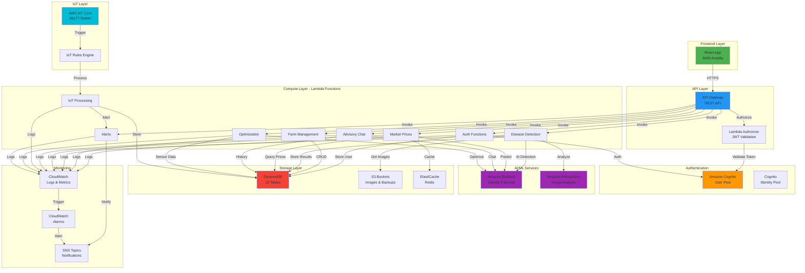
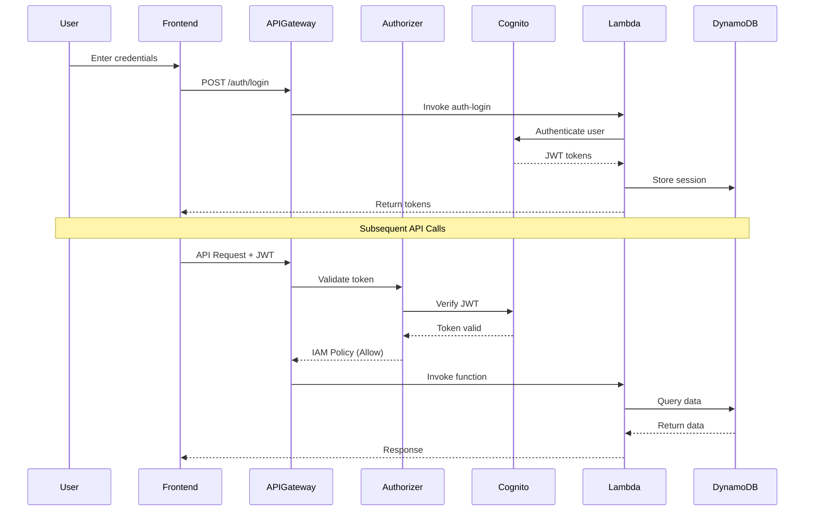
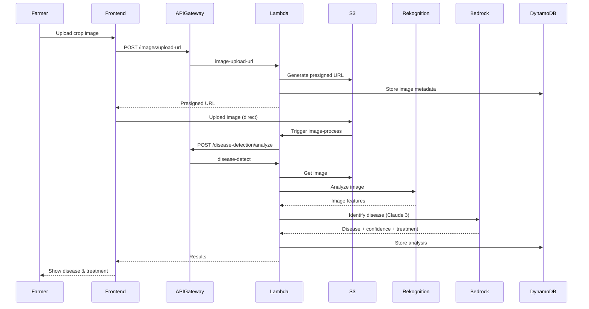
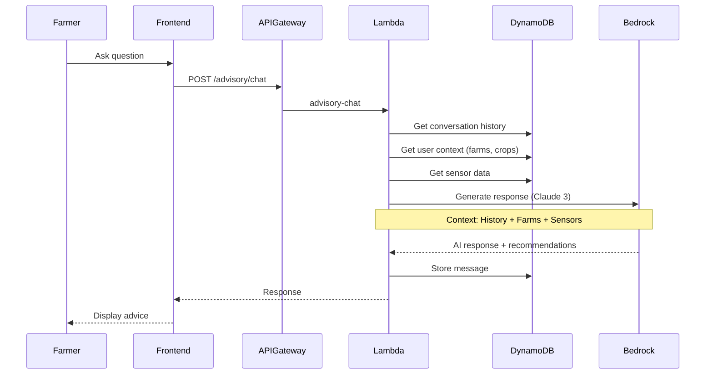
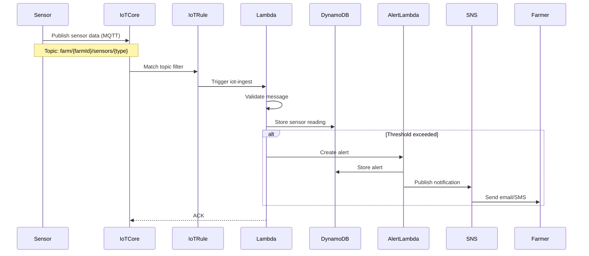
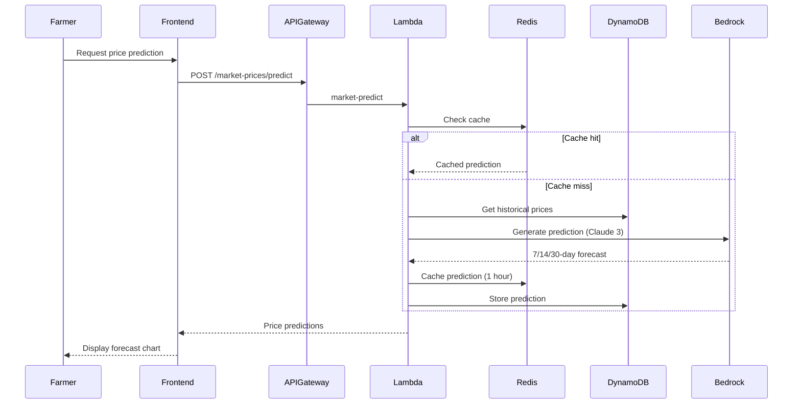
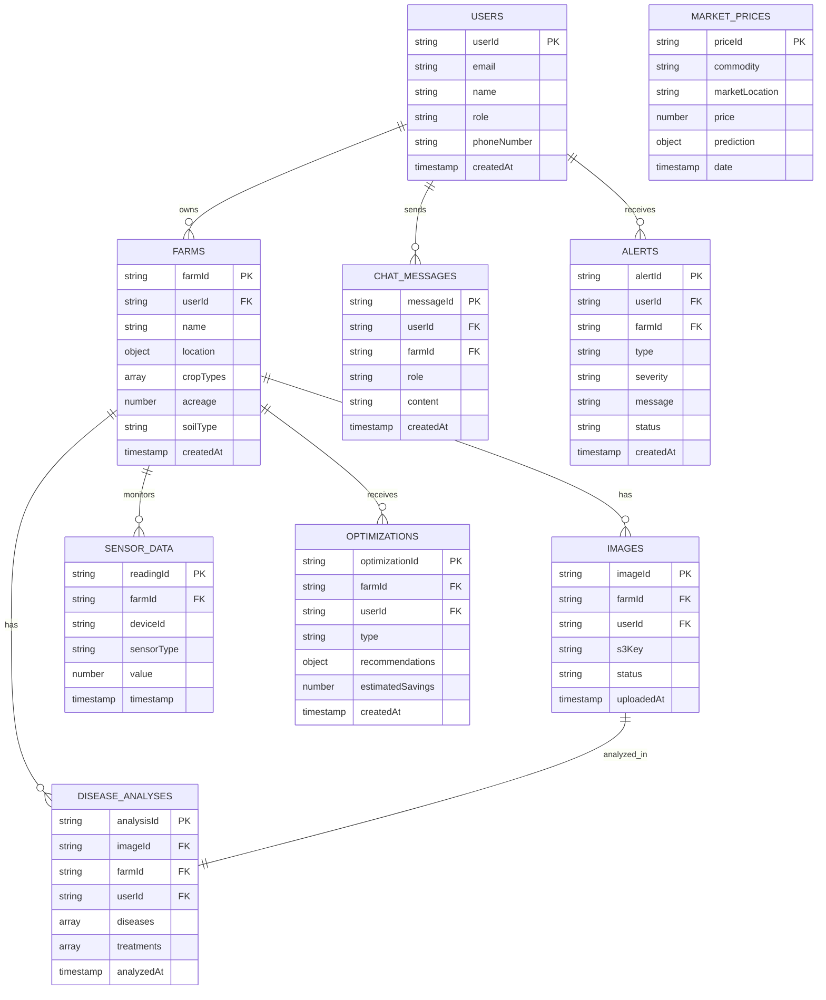
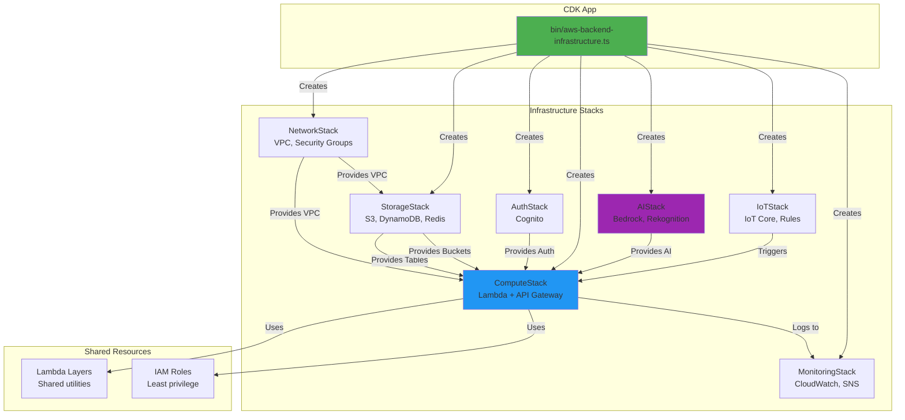
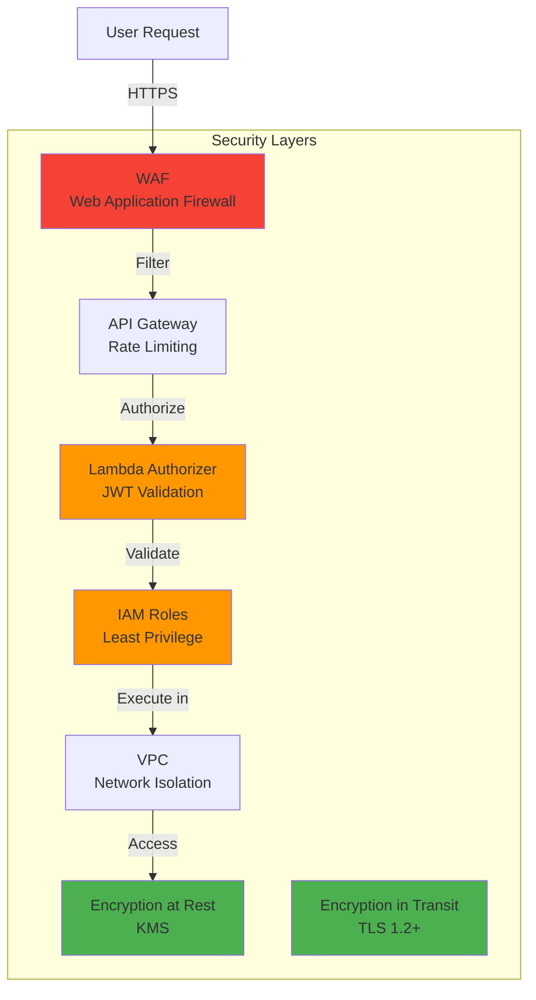

# AWS Backend Architecture - AI Rural Innovation Platform

## 🏗️ High-Level Architecture



---

## 🔐 Authentication Flow



---

## 🌾 Disease Detection Flow



---

## 💬 Advisory Chatbot Flow



---

## 📊 IoT Sensor Data Flow



---

## 💰 Market Price Prediction Flow



---

## 🗄️ Data Model



---

## 🏗️ CDK Stack Architecture



---

## 📁 Project Structure

```
aws-backend-infrastructure/
├── bin/
│   └── aws-backend-infrastructure.ts    # CDK app entry point
├── lib/
│   ├── stacks/
│   │   ├── network-stack.ts             # VPC, Security Groups
│   │   ├── storage-stack.ts             # S3, DynamoDB, Redis
│   │   ├── auth-stack.ts                # Cognito
│   │   ├── compute-stack.ts             # Lambda + API Gateway
│   │   ├── ai-stack.ts                  # Bedrock, Rekognition
│   │   ├── iot-stack.ts                 # IoT Core
│   │   └── monitoring-stack.ts          # CloudWatch, SNS
│   ├── constructs/
│   │   ├── lambda-function.ts           # Reusable Lambda construct
│   │   └── api-endpoint.ts              # Reusable API construct
│   └── config/
│       ├── dev.ts                       # Dev environment config
│       ├── staging.ts                   # Staging config
│       └── prod.ts                      # Production config
├── lambda/
│   ├── auth/                            # Authentication functions
│   ├── farm/                            # Farm management
│   ├── disease/                         # Disease detection
│   ├── market/                          # Market prices
│   ├── advisory/                        # Chatbot
│   ├── iot/                             # IoT processing
│   ├── optimization/                    # Resource optimization
│   └── alerts/                          # Alert management
├── docs/
│   ├── ARCHITECTURE.md                  # This file
│   ├── DEPLOYMENT_GUIDE.md              # Deployment instructions
│   └── API_DOCUMENTATION.md             # API reference
└── test/
    ├── unit/                            # Unit tests
    └── integration/                     # Integration tests
```

---

## 🔄 CI/CD Pipeline

```mermaid
graph LR
    A[GitHub Push] -->|Trigger| B[CodePipeline]
    B -->|Source| C[CodeBuild]
    C -->|Install| D[npm install]
    D -->|Lint| E[ESLint]
    E -->|Test| F[Jest Tests]
    F -->|Security| G[npm audit]
    G -->|Build| H[CDK Synth]
    H -->|Deploy Dev| I[Dev Environment]
    I -->|Integration Tests| J{Tests Pass?}
    J -->|Yes| K[Manual Approval]
    J -->|No| L[Rollback]
    K -->|Approved| M[Deploy Staging]
    M -->|Smoke Tests| N{Tests Pass?}
    N -->|Yes| O[Manual Approval]
    N -->|No| L
    O -->|Approved| P[Deploy Production]
    P -->|Smoke Tests| Q{Tests Pass?}
    Q -->|Yes| R[Success]
    Q -->|No| L
    
    style A fill:#4CAF50
    style R fill:#4CAF50
    style L fill:#F44336
```



---

## 📊 AWS Services Used

| Service | Purpose | Count |
|---------|---------|-------|
| **API Gateway** | REST API endpoints | 1 API, 30+ endpoints |
| **Lambda** | Serverless compute | 40+ functions |
| **Cognito** | User authentication | 1 User Pool, 1 Identity Pool |
| **DynamoDB** | NoSQL database | 10 tables |
| **S3** | Object storage | 2 buckets (images, backups) |
| **ElastiCache** | Redis caching | 1 cluster |
| **IoT Core** | MQTT broker | 1 endpoint |
| **Bedrock** | AI/ML (Claude 3) | 1 model |
| **Rekognition** | Image analysis | 1 service |
| **CloudWatch** | Monitoring & logs | Multiple log groups |
| **SNS** | Notifications | 2 topics |
| **VPC** | Network isolation | 1 VPC, 2 AZs |
| **Secrets Manager** | Secret storage | Multiple secrets |

---

## 🔒 Security Architecture



---

## 💰 Cost Optimization

- **Lambda**: Pay per invocation, 1GB memory
- **DynamoDB**: On-demand pricing, auto-scaling
- **S3**: Lifecycle policies (Glacier after 90 days)
- **ElastiCache**: t3.micro for dev, t3.small for prod
- **API Gateway**: REST API (cheaper than HTTP API for this use case)
- **CloudWatch**: 30-day log retention

**Estimated Monthly Cost**:
- **Development**: $50-100
- **Production (low traffic)**: $200-300
- **Production (high traffic)**: $500-1000

---

## 🚀 Deployment Environments

| Environment | Purpose | Auto-Deploy | Approval Required |
|-------------|---------|-------------|-------------------|
| **Dev** | Development & testing | ✅ Yes | ❌ No |
| **Staging** | Pre-production validation | ❌ No | ✅ Yes |
| **Production** | Live system | ❌ No | ✅ Yes |

---

## 📈 Scalability

- **API Gateway**: Handles 10,000 requests/second
- **Lambda**: Auto-scales to 1000 concurrent executions
- **DynamoDB**: Auto-scales read/write capacity
- **ElastiCache**: Can scale to cluster mode
- **S3**: Unlimited storage
- **IoT Core**: Handles millions of devices

---

## 🔍 Monitoring & Alerting

**CloudWatch Alarms**:
- API Gateway error rate > 5%
- Lambda duration > 10 seconds
- DynamoDB throttling
- S3 bucket size > 100GB
- Bedrock API usage > threshold

**SNS Notifications**:
- Critical errors → Email + SMS
- Operational alerts → Email only

---

**Built with AWS CDK + TypeScript for Infrastructure as Code**
